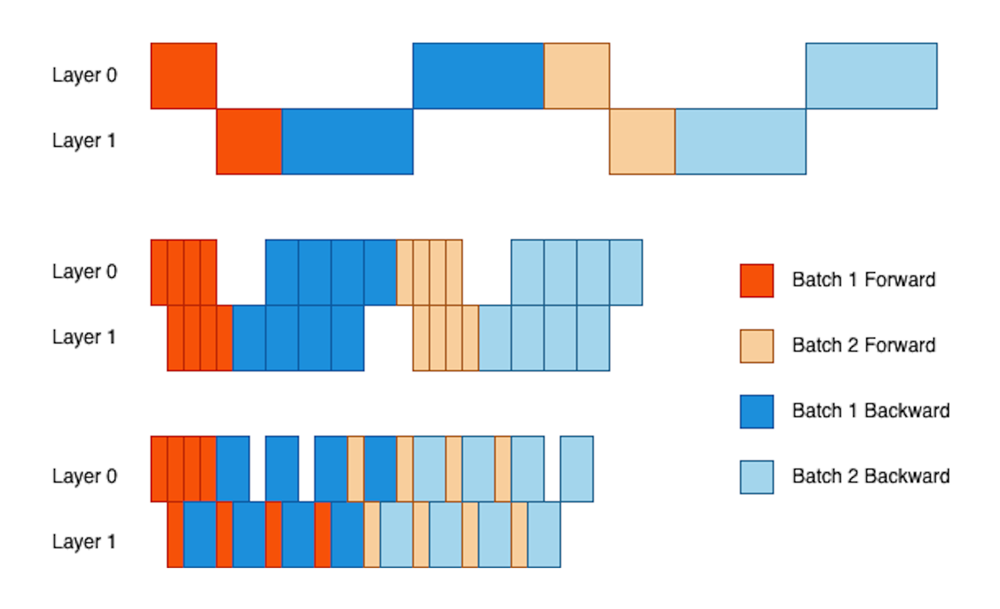

Pipeline Parallelism，也就是将 LLM 的不同层放到不同的 Node 上。

在 Training 的时候，PP 是存在一个依赖，那就是“必须在上一个 batch 的 backward 更新参数结束后，才能开启下一个 batch 的 forward”。因此这就导致了 Pipeline 中存在大量的 bubble。本来应该由下一个 batch 去填满上一个 batch 的 bubble ，但是下一个 batch 因为依赖而不能发射。也就如下图的第一行所示：

因此人们开发了 MicroBatch 技术，也就是说，将 Batch 划分成多个小的 MicroBatch，每个 MicroBatch 结束 Forward 后就可以自行进入下一层，不需要等待同一个 Batch 内的其他 MicroBatch，但是在 Loss 计算和 Optimizer 更新时，依然是按照整个 Batch 去计算，因此并不会有数学上的损失。如图中的第二行所示。

这种方式本质上也是在通过打破依赖（一个 Batch 内的请求必须同步）的方式来降低 Bubble，但是依然没有打破第一个依赖，因此依然还是有不可消除的 Bubble 。

这个思路下主要有两个代表工作，GPipe 就是图中这个样子；而 1F1B 则是在一个 MicroBatch 的 Forward 结束后，尽快开启它的 Backward 。这种思路并不会降低 Bubble，但是尽快开始 Backward ，可以让驻留在显存中的 Activation 尽早释放，减少了缓存压力。

第三种方式就是打破了“下一个 Batch 必须在上一个 Batch 结束后再开始”这个依赖，因此基本上消除的 Bubble （除了启动的时候会有之外，就不会有了），但是这种方式就引入了误差。PipeDream 就是这种思路的代表，它采用了一些方式来缓解这种权重更新的误差。