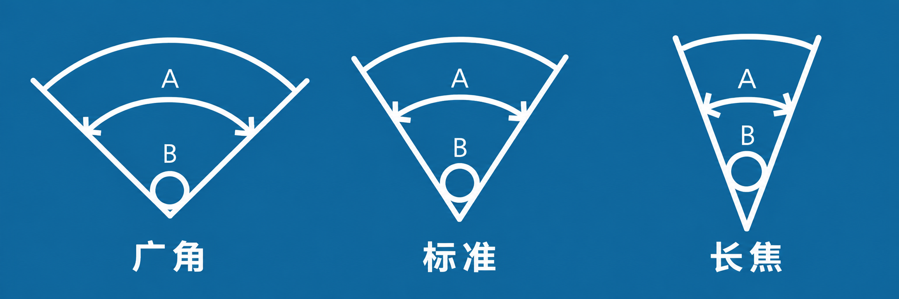
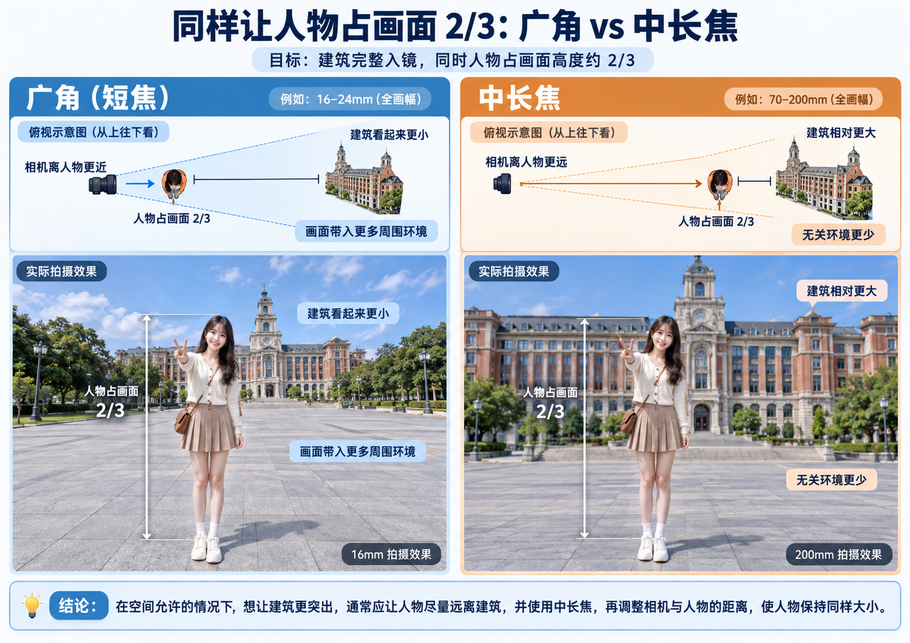
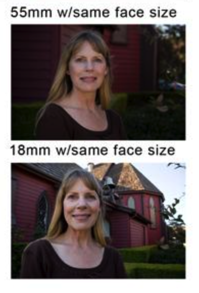

# 焦距

> 有一说一，我并没有理解其中的原理。

“广角”本质上就是“短焦”：焦距越短，视角越大，因此更容易呈现明显的“近大远小”效果。也就是说，当被摄物体与镜头的距离发生变化时，它在画面中的大小变化会更加明显。相对地，长焦的视角更窄，“近大远小”的效果也会减弱。于是，即使被摄物体与镜头的距离发生了变化，它在画面中的大小变化通常也没有广角那么剧烈。

需要特别注意的是，‘焦距’本身并不等同于‘放大’或‘缩小’。虽然在手机上，我们会看到从 `1x` 切换到 `0.6x` 被称为“变广角”，从 `1x` 切换到 `5x` 被称为“变长焦”，看起来像是在描述画面的放大和缩小，但这其实并不是焦距的本质。更准确地说，不同焦距改变的是视角范围，以及由拍摄距离带来的透视表现。

因此，在相同拍摄距离下，广角往往比长焦容纳更多景物，这只是因为它的视角更大。所以，焦距并不直接决定‘画面里能有多少东西’，它真正影响的是视角，以及在不同拍摄距离下画面中各个物体的**相对关系**。

拍照时，我们经常希望**建筑能够完整地出现在画面中，同时人物占据画面的固定比例，例如高度的 2/3**。那么，应该如何选择焦距和拍摄位置呢？最终建议是：**在空间允许的情况下，让人物尽力远离建筑，使用中长焦镜头，并调整相机与人物的距离，使人物占据画面的 2/3。**

为什么呢？首先，无论使用广角还是长焦，我们都可以通过调整拍摄位置，将完整的建筑纳入画面，也可以通过调整相机与人物的距离，让人物占据固定比例。但两者的区别在于：**当人物在画面中的大小相同时，背景相对于人物的大小可能不同。**

使用广角时，相机需要靠近人物。此时，人物与建筑的距离差异相对较大，远处的建筑显得较小，画面往往会包含更多周围环境。使用长焦时，相机需要远离人物。这样一来，相机到人物和建筑的距离比例更接近，建筑相对于人物就会显得更大，更容易成为画面的主要背景，减少无关环境的干扰。

BTW，广角拍人脸会变丑，因为人脸也不是一个完美的弧面，五官甚至也会“近大远小”：

