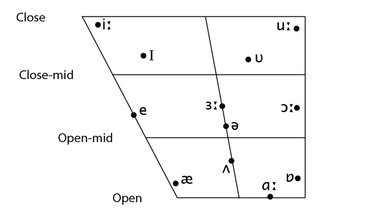

声音是气流从肺部到嘴外导致一系列发声器官震动产生的。

如果气流在发声时不受到阻碍，那么是元音；而如果受到阻碍，那么是辅音。

如果气流不引起声带震动，那么是清音；如果引起震动，那么是浊音。

元音受到圆唇度和舌位的影响，舌位有舌位图可以指示：

其中有几点强调：

- 舌位指的是舌头的最高点，而不是舌尖
- 这个图只是示意图，没有人的口腔是梯形的
- 越靠近中间，那么越放松自然
- 当舌位低的时候，往往嘴巴的开口会张大，这样才使得舌体离上颚的距离更大（也就是相对更低）

最后附一个中文元音对应的舌位图

| i   |     | u    |
|-----|-----|------|
|     |     | e, o |
|     | a   |      |
