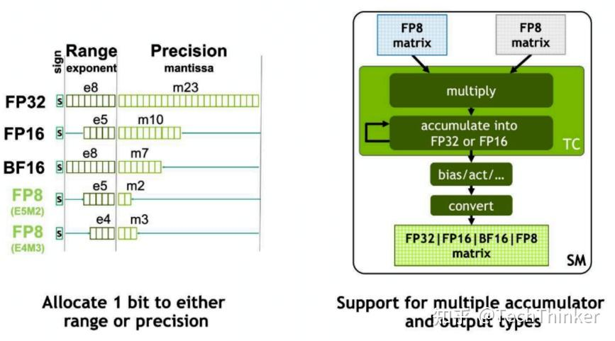

# 浮点数原理

浮点数有 2 个重要部分：指数（Exponent）和尾数（Mantissa）。

当指数增多时，浮点数的表示范围（range）会增大；而当尾数增多时，浮点数的精度（precision）会增加。这两个特性对于模型量化来说都是非常重要的：range 大可以处理一些离群值（outlier），而 precision 大可以有更高的准确率。

可惜的是，这两个部分的位数之和基本上是固定的（最后需要和符号位加起来等于 8 bit 或者 32 bit 之类的），浮点数的表示范围和精度是不可兼得的。

# 格式

- FP8: FP8 就是普通的 8bit float 浮点数格式。FP8 有 2 种具体的格式，E4M3 和 E5M2 ，也就是“4bit exponent, 3bit mantissa”和“5bit exponent, 2bit mantissa”，可以看作是在 range 和 precision 之间的一种 tradeoff 。
- BF16: “BF”代表“Brain Floating Point”，专注于在深度学习中提供更高效的计算，保持较大的动态范围，同时减少内存消耗。相比于 FP16 ，指数位更多，尾数位更少。
- Posit8: 它的 exponent 和 precision 是可以动态调整的。它在 1 附近的精度更高，且能表示的动态范围更大。

# 方法

量化技术可以分为 2 类：

## PTQ

训练后量化（Post-Training Quantization, PTQ）：无需重新训练模型，直接对预训练模型量化。

- ​​RTN​： Round-to-Nearest, 最为直观的量化方法，最简单的四舍五入量化，直接对权重取整。
- AWQ: Activation-aware Weight Quantization, 通过分析激活值（activation）的分布动态调整量化策略，对影响较大的权重保持高精度，而对于影响较低的权重使用低精度。
- GPTQ: Gradient-based Post-Training Quantization, 基于梯度的逐层量化

## QAT

量化感知训练（Quantization-Aware Training, QAT）​：在训练过程中模拟量化误差，提升最终量化精度
