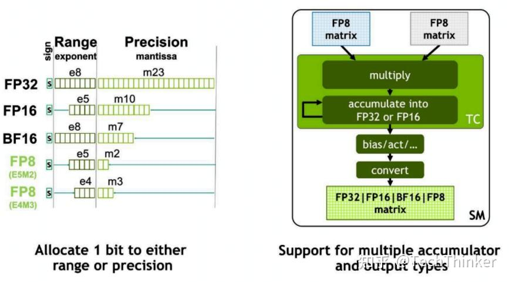
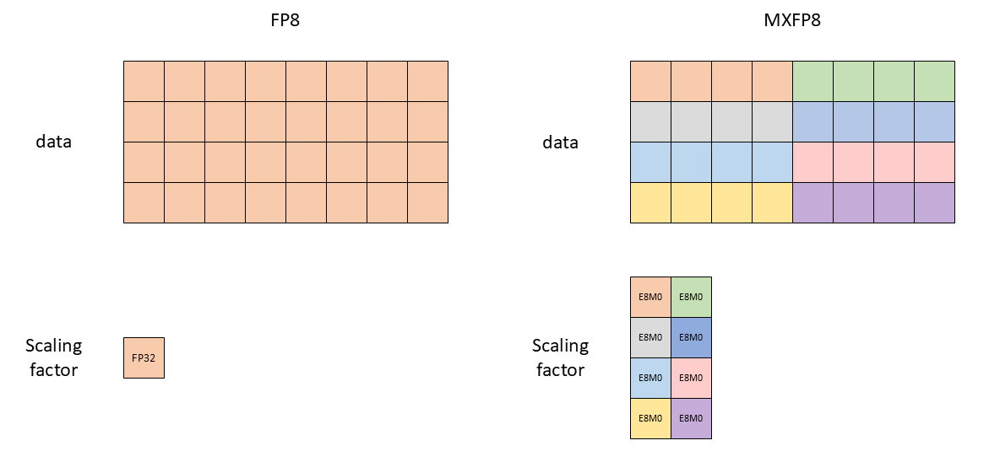
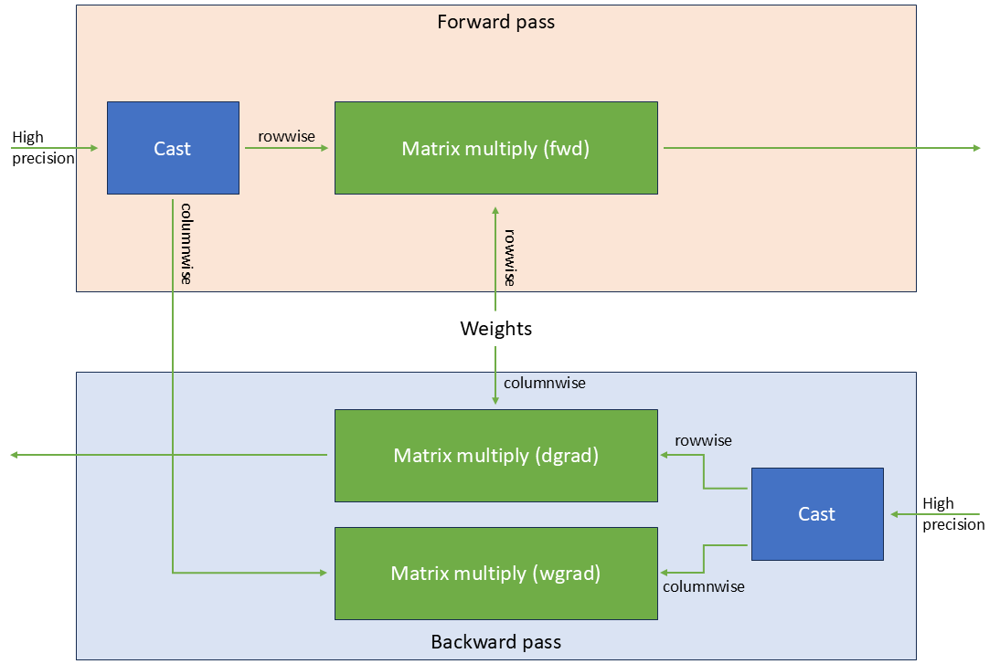
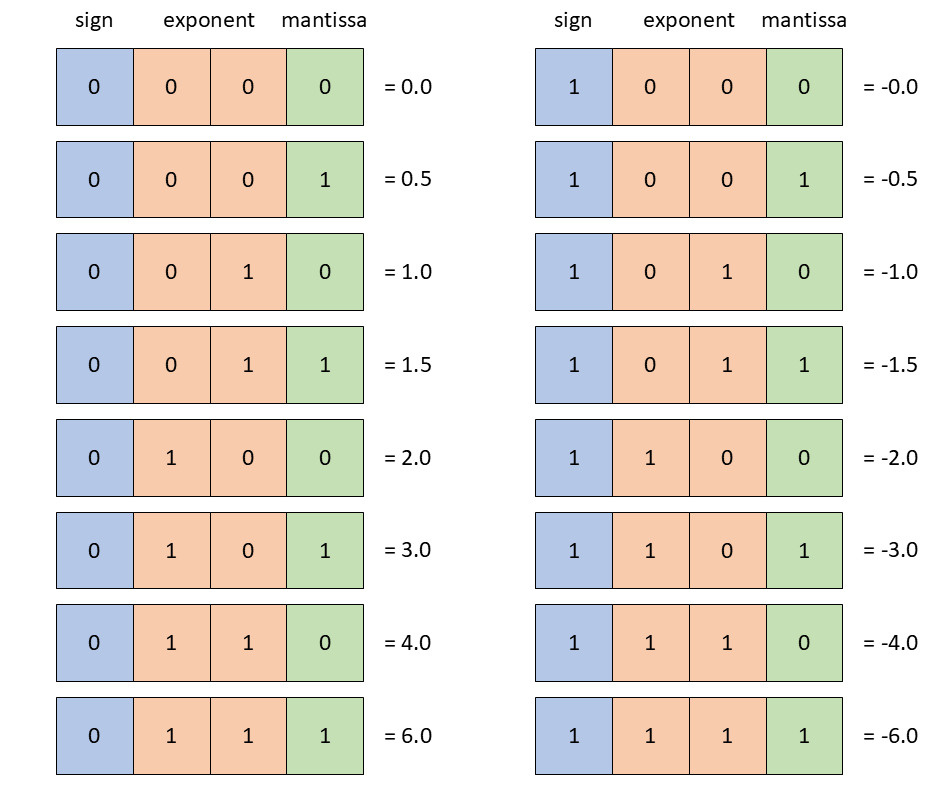

# 浮点数原理

浮点数有 2 个重要部分：指数（Exponent）和尾数（Mantissa）。

当指数增多时，浮点数的表示范围（range）会增大；而当尾数增多时，浮点数的精度（precision）会增加。这两个特性对于模型量化来说都是非常重要的：range 大可以处理一些离群值（outlier），而 precision 大可以有更高的准确率。

可惜的是，这两个部分的位数之和基本上是固定的（最后需要和符号位加起来等于 8 bit 或者 32 bit 之类的），浮点数的表示范围和精度是不可兼得的。

# 格式

- FP8: FP8 就是普通的 8bit float 浮点数格式。FP8 有 2 种具体的格式，E4M3 和 E5M2 ，也就是“4bit exponent, 3bit mantissa”和“5bit exponent, 2bit mantissa”，可以看作是在 range 和 precision 之间的一种 tradeoff 。
- BF16: “BF”代表“Brain Floating Point”，深度学习训练的梯度经常出现数值范围爆炸/消失的情况，因此 BF 16 保持较大的动态范围（E8M7）。相比于 FP16（E5M10） ，指数位更多，尾数位更少。
- Posit8: 它的 exponent 和 precision 是可以动态调整的。它在 1 附近的精度更高，且能表示的动态范围更大。

通常，前向传播中的激活值和权重需要更高的精度，因此 E4M3 数据类型最适合用于前向传播。然而在反向传播中，流经网络的梯度通常对精度损失不那么敏感，但需要更大的动态范围。因此，梯度最适合使用 E5M2 数据格式存储。

# 方法

量化技术可以分为 2 类：

## PTQ

训练后量化（Post-Training Quantization, PTQ）：无需重新训练模型，直接对预训练模型量化。

- RTN： Round-to-Nearest, 最为直观的量化方法，最简单的四舍五入量化，直接对权重取整。
- AWQ: Activation-aware Weight Quantization, 通过分析激活值（activation）的分布动态调整量化策略，对影响较大的权重保持高精度，而对于影响较低的权重使用低精度。
- GPTQ: Gradient-based Post-Training Quantization, 基于梯度的逐层量化

## QAT

量化感知训练（Quantization-Aware Training, QAT）：在训练过程中模拟量化误差，提升最终量化精度

# Block 量化

## MXFP8

以前的量化一般是整个 tensor 共用一个 scale ，比如说 FP8 就会一整个 tensor 使用一个 FP32 作为 scale 。

而新的 MXFP8 则会给每连续的 32 个元素一个 E8M0 作为缩放因子（相当于只有移位，而没有尾数调整了）。由于采用了多个缩放因子，tensor 的动态范围要求降低，因此可以使用 E4M3 格式。

在反向传播中，会出现对于前项传播矩阵的转置操作，而 MXFP8 要求在矩阵乘法的规约维度上面连续，这就导致我们需要给矩阵和矩阵的转置分别进行一次 MXFP8 的量化。

但是这就相当于在 forward 的时候按行量化，而在 backward 的时候，按列量化，所以两次量化不同，也会存在差异性。至于解决方案嘛，可以采用 2D 量化，也就是一个 tile 共享一个 scale 。这样转置的时候就不会有误差了。但是这样就要求这个 tile 是连续的，这就导致此时一个 tensor 中的 layout 就变成了 zigzag 布局。

## NVFP4
##
更进一步，[[NVIDIA]] 引入了 NVFP4 格式（之所以不叫 FP4 格式，是因为有专门的 IEEE FP4 格式）。遵循 E2M1 格式（其实我觉得已经很难看懂了）。

这个格式每 16 个连续的元素共享一个 FP8 E4M3 作为 scale ，为了补齐精度，整个 tensor 共享一个 FP32 全局 scale 。

# 硬件支持

## 配合

Tensorcore 是只负责乘加运算的，是不会做 scale 或者 quant/dequant 操作的，这些操作都是由 CUDA core 来做。

## TC Support

- `BF16×BF16 -> FP32`：从 Ampere 开始支持
- `INT8×INT8 -> INT32`，`INT4×INT4 -> INT32`：从 Ampere 开始支持
- `FP8×FP8 -> FP32/FP16`：从 Hopper 开始支持
- `MXFP8×MXFP8 -> FP32/FP16`：从 Blackwell 开始支持
- `NVFP4×NVFP4 -> FP16/BF16`：从 Blackwell 开始支持

不可以把后者简单理解成乘积（不然两个 int4 相乘怎么也到不了 int32 ），而是应该将其理解成乘加 accumlator ，多次对于乘积的累加后，精度要求就会变高。
