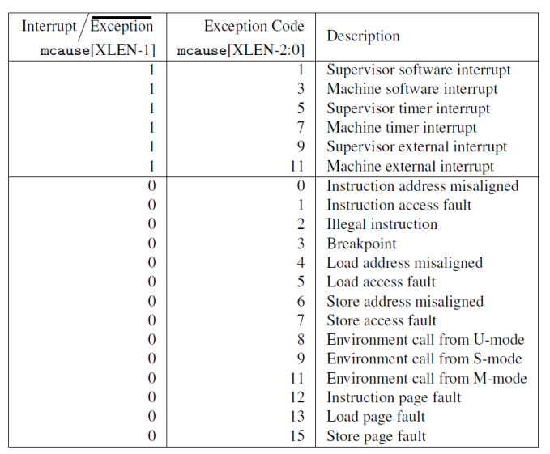

# 种类

RISCV 的异常分为同步异常和中断两种，可以根据 `mcause` 的最高位来区分。

RISCV 的同步异常分为 5 种：

- 访问错误异常：当物理内存的地址不支持访问类型时发生（例如尝试写入 ROM）。
- 断点异常：在执行 `ebreak` 指令，或者地址或数据与调试触发器匹配时发生。
- 环境调用异常：在执行 `ecall` 指令时发生。
- 非法指令异常：在译码阶段发现无效操作码时发生。
- 非对齐地址异常：在有效地址不能被访问大小整除时发生。

中断源分为 3 种：

- 软件：向内存映射寄存器中写入数来触发，由一个 hart 中断另一个 hart 。
- 时钟：当 `hart` 的时间比较器（一个名为 `mtimecmp` 的内存映射寄存器）大于实时计数器 `mtime` 时，会触发时钟中断。
- 外部：由平台级中断控制器（大多数外部设备连接到这个中断控制器）引发。

不过我也不知道为啥，这些种类并不会一一对应 `mcause` 的编码，而是一对多，总结如下：

# 寄存器

在 M-mode 下，一共有 8 个 CSR 是 RISCV 异常处理所必须的，如下表所示：

| CSR | 功能 |
|----|----|
| mtvec(Machine Trap Vector) | 异常发生时处理器跳转到的地址 |
| mepc(Machine Exception PC) | 发生异常的指令 PC |
| mcause(Machine Exception Cause) | 异常发生的种类 |
| mie(Machine Interrupt Enable) | 处理器目前能处理和忽略的中断 |
| mip(Machine Interrupt Pending) | 处理器正在准备处理的中断 |
| mtval(Machine Trap Value) | 保存附加信息，比如地址异常中出错的地址、发非法指令异常中指令本身 |
| mscratch(Machine Scratch) | 暂时存放数据 |
| mstatus | 运行状态 |

前面 6 个寄存器都专用于异常处理， `mscratch` 寄存器在异常处理中没有明确意义，软件开发者可以当成一个指针来使用它，比如说在 Exaros 中它用来保存 `TrapFrame` ，~mstatus~ 是运行状态寄存器，它在异常处理中只有一些域发挥作用，如下所示：

- `MIE`: Machine Interrupt Enable 全局中断使能
- `MPIE`: Previous Machine Interrupt Enable 在异常发生后保存 `MIE` 的旧值

需要区分 `mstatus` 的 `MIE` 位和 `mie` 寄存器， `MIE` 只有一位，置 1 表示允许中断， `mie` 是一个完整的寄存器，其中每一位都对应一个中断的使能，比如说 `mie[7]` 对于 M 模式的时钟中断。而 `mip` 也是一个完整寄存器，每一位对应一个中断“当前是否待处理”。如果 `mstatus.MIE & mie[7] & mip[7] == 1` ，则处理器可以处理时钟中断。

`mstatus` 这些寄存器只有一个副本，那是不是意味着没法进行中断嵌套了呢？并不是的，只需要保存到栈上即可。

默认情况下，所有异常（无论在什么权限模式）都会被转发到 M 态。不过 M-mode 可以通过委托机制交给 S-mode
