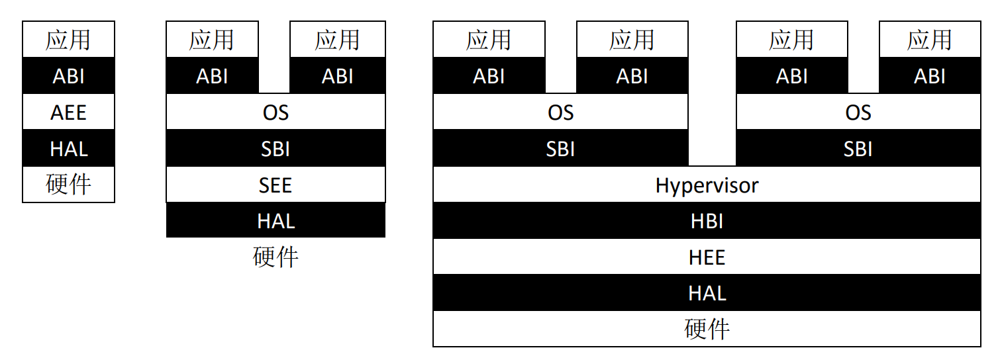

# 特权模式

在 RSICV 中，具有 4 个特权模式：

| 模式 | 含义                                |
|------|-------------------------------------|
| U    | User/Application Mode, 运行用户进程 |
| S    | Supervisor Mode, 运行操作系统       |
| H    | Hypervisor Mode, 运行虚拟机监视器   |
| M    | Machine Mode                        |

软件栈结构如下：

可以看到 RISCV 的软件栈的“层数”要更加多，这是因为它引入了 `BI` 层和 `EE` 层来增加可移植性。 `EE` 是 Execute Environment 的意思，表示为上层软件提供服务的实体，而 `BI` 是 Binary Interface 的意思，表示服务具体的协议。举个例子，OS 是用户的 EE ， 系统调用是 BI 。我们常说的 openSBI ，其实是是一种 SEE 和 SBI 的集合体。

软件栈最下层是 HAL(Hardware Abstract Layer) ，它是一个软件，提供了硬件平台的封装。

需要注意的是，一块 RISCV 的板子并不需要完全实现这四种特权模式以及对应的 ISA ，硬件厂商完全可以不实现 Hypervisor Mode 。这些特权模式共有 4 种组合模式，硬件厂商可以选择其中的一种来实现（必须实现 Machine Mode）：

| 名称                 | 组合          |
|----------------------|---------------|
| Simple Embedded      | M             |
| Secure Embedded      | M + U         |
| Unix-like OS capable | M + S + U     |
| Virtual Machine      | M + H + S + U |

这些特权等级并不平等，比如说 H-mode 这个特权等级，需要通过 `H` 拓展来获得（主要提供第二级地址翻译和保护），否则一般是没有的。S-mode 也必须通过 M-mode 的异常委托机制才能发挥作用，M-mode 具有一种“拥有全部硬件权限”的语义，而不是像 Arm64 的 EL3 一样只是安全世界的一个守门人。将原本的 `M` 变成 `M + U` 似乎只是不信任的软件可以被隔离，提高系统的安全性，而将 `M + U` 编程 `M + S + U` ，似乎只是希望借用 S-mode 下虚拟内存功能，这是 M-mode 所不具备的。

我个人感觉因为 RISCV 的诞生比较靠后，所以可能在设计之初就对市场里的需求有一个总体的把握，不像 X86 或者 ARM 一样需要一步步迭代。此外 RISCV 在一开始就不是一种 **增量一体式** 的 ISA 设计，而是一个 **模块化** 的 ISA ，所以对于各种硬件功能的解耦更加彻底。

# 运行状态

在某种简单的实现中， `sstatus` 就是 `mstatus` 的一部分，而不是完全不同的 banked register。从这幅图可以看出些许端倪。

# 路由

- 使用 `mret` 从 M-mode 返回。
- 使用 `sret` 从 S-mod 返回。
- 使用 `ecall` 请求服务

arm64 有多个请求指令，只有 1 个返回指令，RISCV 有多个返回指令，只有 1 个请求指令。arm64 返回的异常等级根据 `SPSR` 决定，RISCV 的请求等级默认是 M-mode, M-mode 可以委托给 S-mode 处理。
