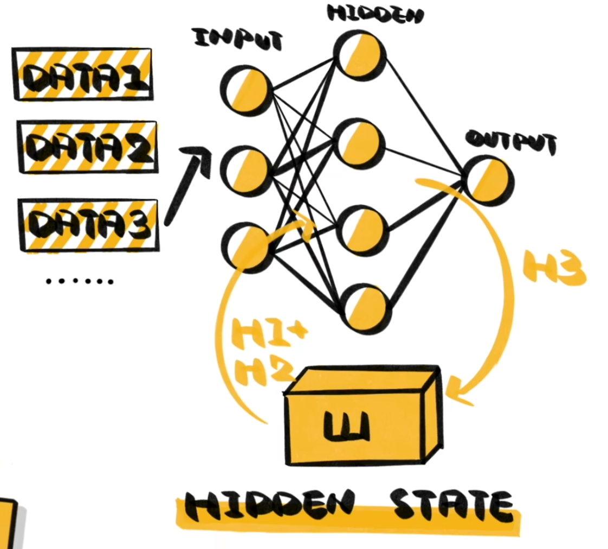

循环神经网络（RNN, Recurrent Neural Network）中存在循环连接，隐藏层的输出会作为下一时间步的输入（时间维度上的反馈）。

数学表达：

``` math
h_{t} = \sigma(W_{h} h_{t} + W_{x} x_{t} + b)
```

相比于原本简单的 [[FFN]] ：

``` math
h_{t} = \sigma(W_{x} x_{t} + b)
```

或者更直观的表达，对于机器翻译等许多上下文存在依赖的任务，我们需要一个结构来存储（或者更形象一些，“记忆”）上下文信息，也就是 RNN 中的$h_{t}$ 隐藏层。不过这种方式好像被 [[Transformer]] 打败了。如下图所示：



RNN 有很多改进，例如：[[LSTM]], GRU 。需要注意 [[ResNet]] 并不是。
