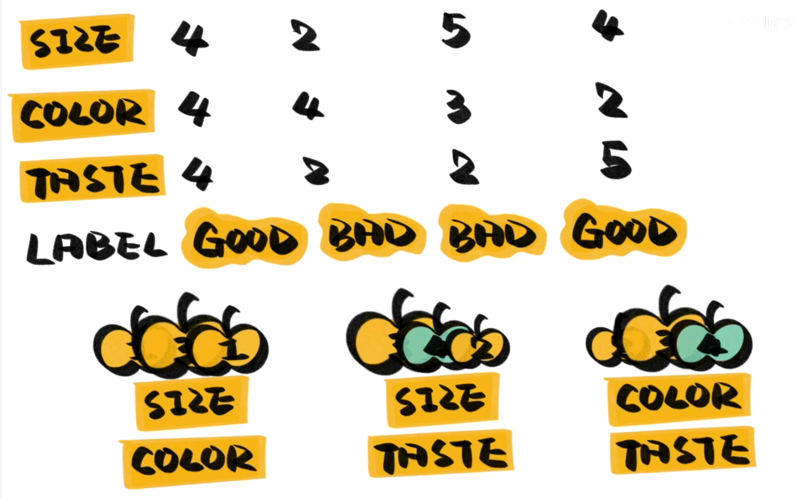

Random Forest 可以被简单理解为具有多个决策树，每个决策树都可以对最终答案进行投票，本质是一种 Bagging Ensemble Method 。

之所以被称为随机森林，是因为我们使用随机的方法来构建每个决策树，每个决策树都是不同的。具体的说，我们只会随机选取数据集中的部分数据的部分特征来生成决策树。如下图所示：

随机的过程降低了异常值和异常特征对于实验结果的影响。

随机森林不容易出现过拟合，能处理高维数据，训练速度快。
