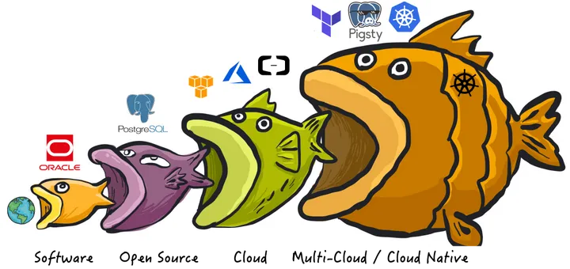
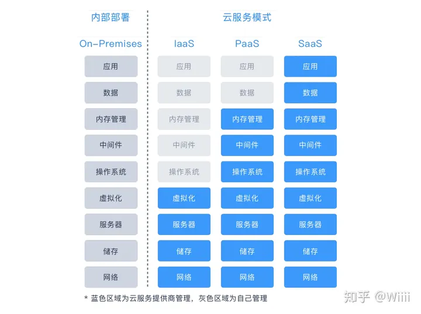

24 年 3 月 21 日，[[Redis]] 宣布将不再遵循 BSD 3-Clause 开源协议进行分发。从 Redis 7.4 版本开始，Redis 采用 SSPLv1 和 RSALv2 双重许可证。

具体来说，新的协议是 non-free, source-available licenses 。这是说，只有源码是 available 的，用户不得将软件商业化或作为托管服务提供给其他人。这个协议被称为“只针对云厂商的闭源协议”。

为了弄清楚新闻的来龙去脉，有必要弄清楚参与事件的双方：

- Redis 公司及社区：主导开发数据库软件 Redis 的组织，是云厂商的上游
- 云厂商：提供 Redis 软件的商业托管服务的公司，是 Redis 的下游

二者的关系有一些类似于 Linux Kernel 与 Redhat Enterprise Linux 发行版之间的关系。

因为 Redis 原本是开源的原因，导致云厂商可以免费使用 Redis 软件，白嫖 Redis 公司和社区的贡献，而不和社区一起维护 Redis，还挤占了 Redis 开源工程师的利益。

在 Redis 眼中，云厂商扮演了侵吞 Redis 开源社区，“摘取胜利果实”的角色：

而在云厂商的角度，托管 Redis 并不是一个简单的白嫖行为。公有云厂商需要把开源数据库内核套上壳，包上管控软件跑在托管硬件上，并建设共享开源专家池提供咨询与支持，便成了云数据库服务 （RDS）。所以费用从原本的 20 ¥/核 变成了 300 ～ 1300 ¥/核 情有可原。

垄断与反垄断的斗争一直在继续，在上个世纪，垄断者的闭源软件在和反垄断者的开源软件做斗争。闭源和开源的矛盾，本质是垄断与反垄断的矛盾。而在现在，云厂商是否是一种新的垄断形式呢？那么反垄断者是否应该使用新的武器去与之对抗呢？
