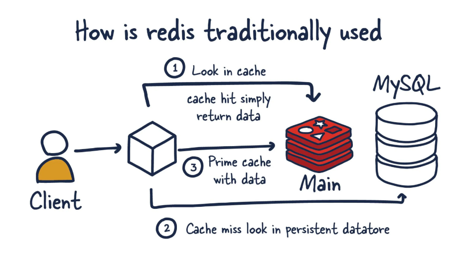
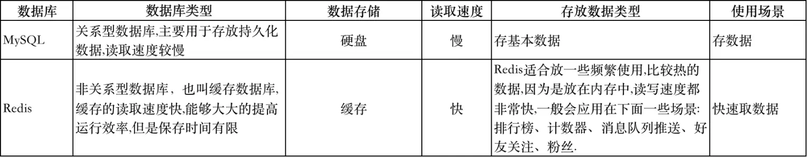

Redis 是基于内存的键值数据库，是 [[NoSQL]] 运动中的代表项目。

基于内存的意思是它在默认情况下，将数据保存在内存中而不是外存中。但是内存数据库虽然相比于外存性能占优，但是却具有易失性。不过其实不用过于担心，Redis 如果运行在服务器上，那么就不需要担心频繁重启导致数据丢失，此外，Redis 一般会用作传统外存数据库的缓存，起加速外存数据库，比如说 [[MySQL]] 的作用。如下图所示：

MySQL 这种传统数据库的基本数据结构是二维表结构，这个结构复杂且功能强大。而 Redis 的基本数据结构是键值对，相比于表结构要更加简单，描述能力弱且没有形式化感。

Redis 与 MySQL 的对比如下：

Redis 的默认端口是 6379 ， `6379` 在 9 键输入中对应的是 `MERZ`, 是意大利的一名明星（Redis 的作者也是意大利西西里人），作者和他的朋友认为 MERZ 是“蠢笨”的代名词，就选了这个作为默认端口号。
