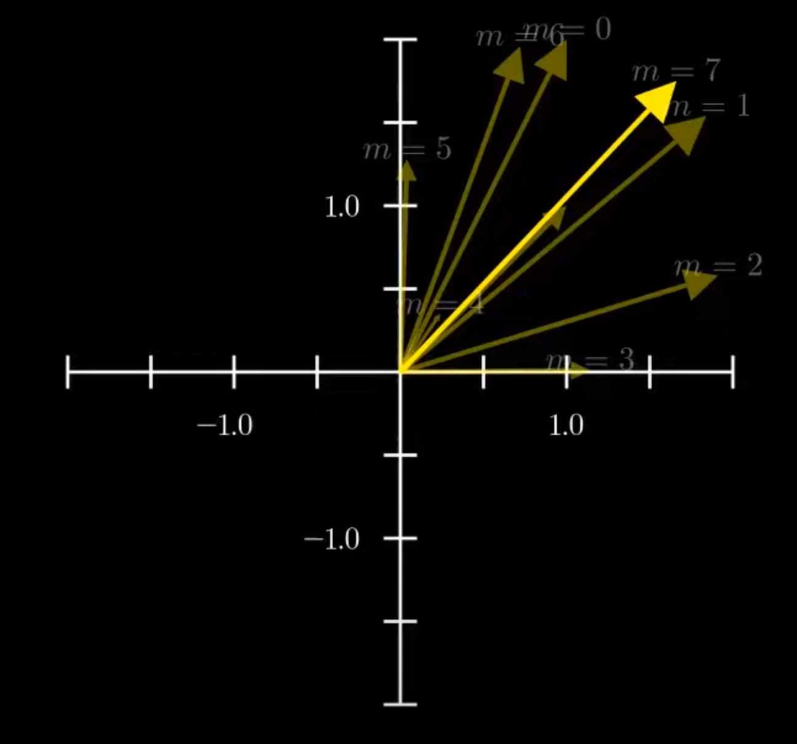
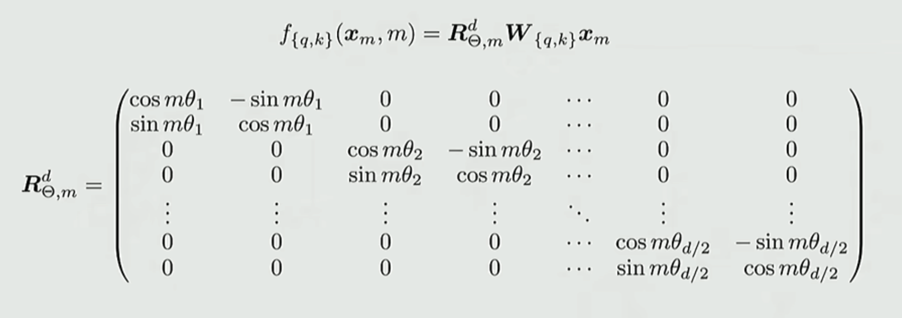
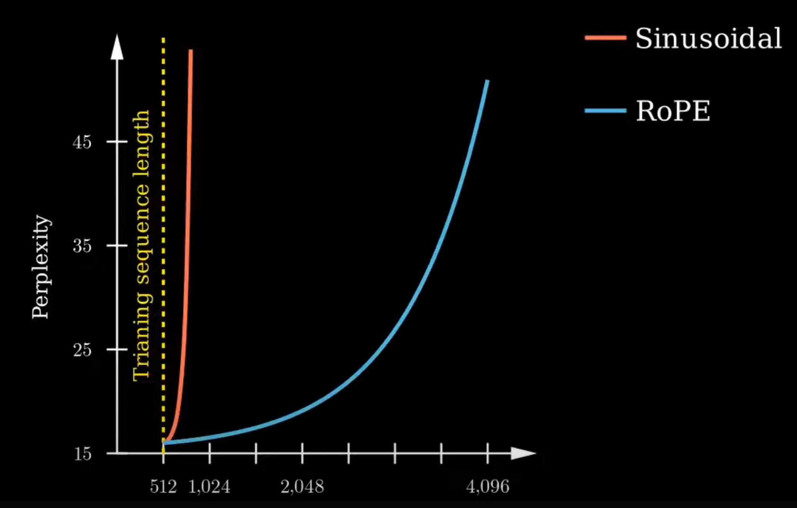

# 加性位置编码

这是 "Attention is All You Need" 中提到的方法，有如下表达：

$$
q_{m} = W_{q} \cdot (x_{m} + PE(m))
$$

$$
k_{m} = W_{k} \cdot (x_{m} + PE(m))
$$

$$
PE(m) = [ \sin(\frac{i}{10000^{\frac{0}{d}}}), \cos(\frac{i}{10000^{\frac{0}{d}}}), \sin(\frac{i}{10000^{\frac{2}{d}}}), \cos(\frac{i}{10000^{\frac{2}{d}}}), \cdots , \sin(\frac{i}{10000^{\frac{d}{d}}}), \cos(\frac{i}{10000^{\frac{d}{d}}}) ]
$$

其中 $m$ 是 token id 或者说 position id ，$d$ 是模型维度（也就是 $x$ 的维度）。

直观上看，就是在原本的 $q, k$ **加上** 一个随位置变化的角度向量，这样 LLM 就可以获得位置信息了。但是这种加性操作产生的向量变化是非常随机的（一个随机的偏移），这就导致 LLM 很难掌握其中的规律，导致训练成本大（死记硬背），且在更长文本的拓展性弱。如下所示，图中的 $m$ 即 $i$ ，可以看到毫无规律。

这种位置编码一般只需要在输入时编码一次，这个编码会进入每一个 transformer 块中。

# RoPE

RoPE 是一种 **乘法** 位置编码，有如下表述：

$$
q_{m} = W_{q} \cdot R_{m} \cdot x_{m}
$$

$$
k_{m} = W_{k} \cdot R_{m} \cdot x_{m}
$$

$$
R_m = \bigoplus_{i=0}^{d/2-1} \begin{pmatrix}
\cos(m\theta_i) & -\sin(m\theta_i) \\
\sin(m\theta_i) & \cos(m\theta_i)
\end{pmatrix}
$$

$$
\theta_i = 10000^{-2i/d}
$$

其中 $R_m$ 是一个近似对角矩阵，每个对角单元是一个 $2 \times 2$ 的旋转矩阵。这使得原本的向量中的 $d$ 个分量，被分成了两两一组，按照不同的速度去旋转。

可以看出用这种方法，位置编码变得更有规律，是的 LLM 学习起来更轻松，长文本的拓展性更好。

