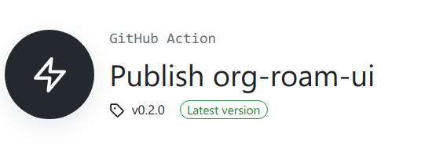

This is `org-roam-ui` rendering test.

# Headline

## headlien 2

### headline 3

# Chinese

这是一段中文测试。

这是另一段中文测试。 这是一段没有分行的中文测试。

# Table

| hello | world  | 你好   | 世界 |
|-------|--------|--------|------|
| bye   | father | 再见呀 | 爸   |

# Math

$\LaTeX \lambda$

# Code

``` c
#include <stdio.h>

int main()
{
  printf("Hello, world.");
  return 0;
}
```

# List

- item 1
- item 2
  - [ ] item 2-1
  - [ ] item 2-2
- item 3
  1.  item 3-1
  2.  item 3-2

# Image



# Emphasize

**This** *is* <u>a</u> `emphasize` ~~test~~.
