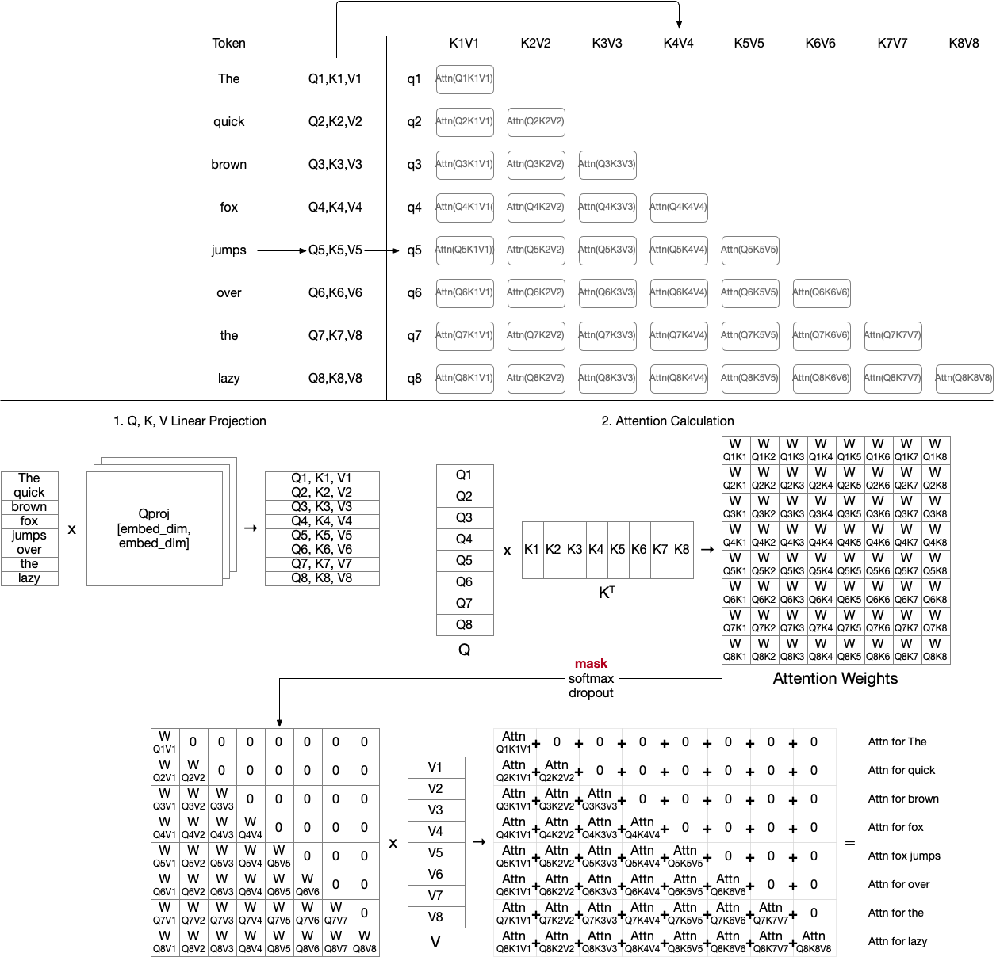
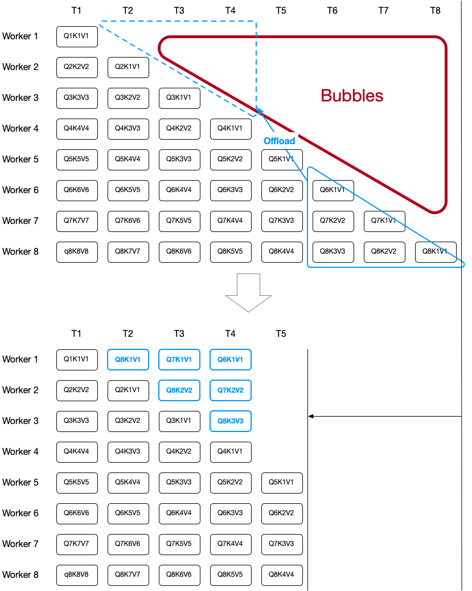
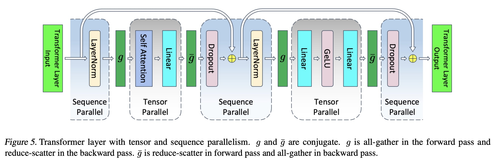

# Ring Self-Attention (RSA)

Sequence Parrallel (SP) 指的是对于很长的输入序列，采用并行的方式，将序列分成多段，然后并行的进行处理。我个人觉得，应该是用在 training 或者 inference prefill 的时候。

更具体而言，SP 并行的对象是 Attention 机制，如下所示：

$$
softmax(\frac{Q \cdot K^{T}}{\sqrt{d}}) \cdot V
$$

如果我们将序列分割成多段，那么每个 node 就只会有一部分的 $Q, K, V$ ，为了获得最终的结果，节点通信是在所难免的。问题是，通信的内容是什么？然后我们就会发现，只需要让 $K, V$ 矩阵通信，让每个 node 都获得完整的 $K, V$ 就可以了。

我们可以仅根据部分 $Q$ 就计算出部分的结果，因为从原理上讲，每个 $q$ 向量就对应一个输出向量，这个输出向量最终会进入下一层。只有最后一层的最后一个输出向量会变成 decode 阶段生成的第一个 token ，但是这并不意味着其他层的其他向量没有作用。这是我之前的一个误区。

RSA 就是采用 ring 的形式通信 $K, V$ 向量，如下所示：

# DistAttention

RSA 的缺点在于，对于 Mask Attention ，不同 node 之间存在负载不均衡的问题，因为对于不同行，它们的长度是不一样的。因此我们提出了取长补短的方式：

不过似乎这里依然没有用 softmax reduce 的技术，只是在计算完 $QK^{T}$ 后，再将其发回原本应该的位置，然后再执行 softmax 。

# RingAttention

前面的方法从直观上看，就是每个 node 负责 $QK^{T}$ 矩阵的特定行的计算，因为 softmax 是按行执行的，所以在这里，并不会引入处理全局 softmax 的问题。只有当一行被分给不同的 node 的时候，才会存在 softmax reduce 的问题。而这个问题被类似于 [[FlashAttention]] 之类的技术解决得很好。

但是这样处理的问题就在于，需要维持一个非常大的 buffer 来容纳整行的 $QK^{T}$ ，而 FlashAttention 技术可以改善这一点，事实上，RingAttention 技术就可以理解为分布式的 FlashAttention 。

# Context Parallelism

Context Parallelism 与 Sequence Parrallelism 并没有区别，只不过现在 Sequence Parrallelism 的概念被 NVIDIA 抢占了，它指的是一种与 [[TP]] 进行结合的技术：

SP 的核心是将张量并行（Tensor Parallelism, TP）无法覆盖的模块（如 LayerNorm、Dropout、全连接层等）通过序列维度拆分实现并行。但是具体是什么，我并不知道。

所以严格意义上来说，这一篇博客的内容应该叫作 CP 。
