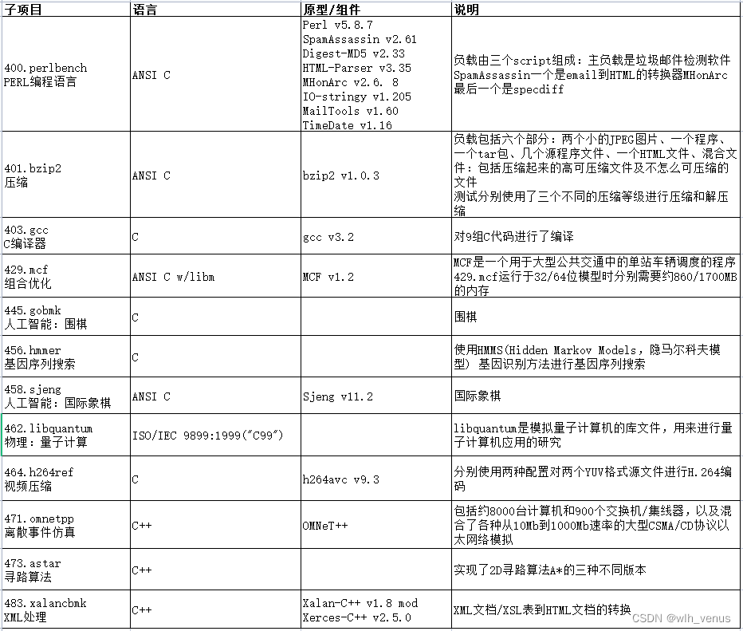
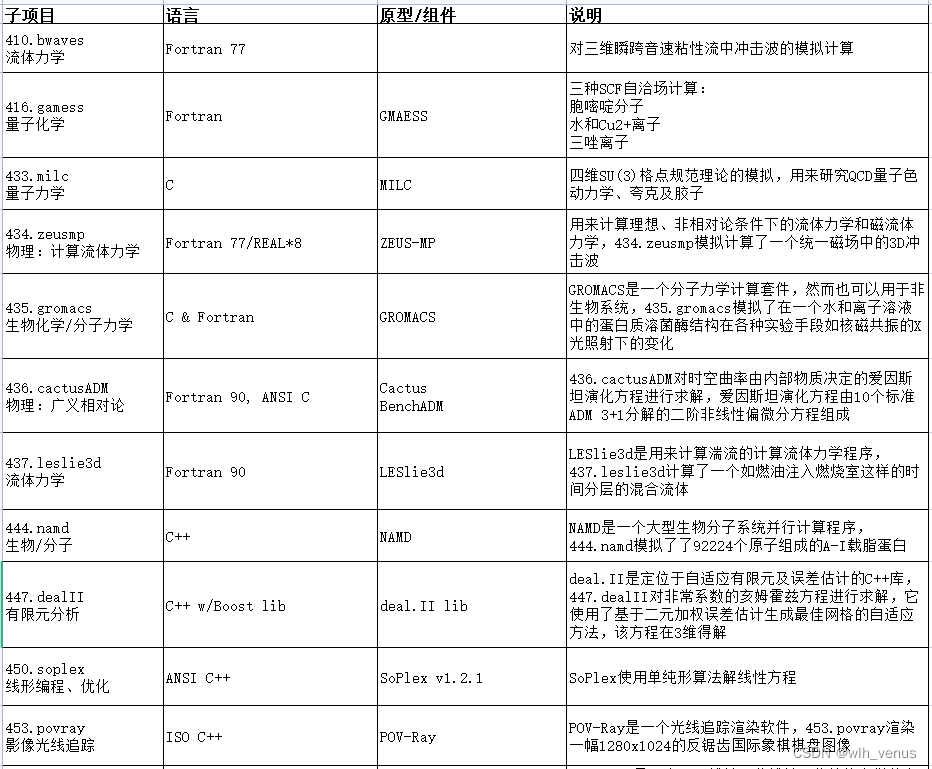

# 构建

SPEC，全称 Standard Performance Evaluation Corporation 。SPEC CPU 不是免费的，所以需要自己找资源下载。

因为 bencmark 使用的是 [[C]], [[Perl]] 和 [[Fortran]] ，并且使用了 bzip ，所以需要使用如下命令安装相关依赖：

``` shell
apt install -y {gcc,g++,gfortran}-4.9
```

我在安装完 `gfortran` 后，发现 SPEC CPU 使用的是 `f90` ，但是我并没有，所以我用如下命令将 `f90` 链接到 `gfortran` ：

``` shell
sudo ln -s /usr/bin/gfortran /usr/local/bin/f90
```

按理说我们可以直接使用如下命令进行安装，也就是将现成的二进制文件拷贝到指定路径：

``` shell
./install.sh
```

但是对于很多架构而言，是没有构建好的二进制文件的，需要自行构建，也就是执行如下命令：

``` shell
./tools/src/buildtools
```

构建完之后似乎不需要再安装了。

# 运行

在运行前需要先配置环境变量

``` shell
source ./shrc
```

SPEC CPU 由多个 benchmark 组成，你可以使用如下命令来执行名为 `bzip2` 的 benchmark

``` shell
runspec bzip2
```

当然也可以用如下命令来跑全部的 `int` 、 `float` 和所有测试：

``` shell
runspec int
runspec fp
runspec all
```

# 配置

而实际上， `runspec` 有多个命令选项，它们都可以使用 `--help` 参数查看，其中比较重要的有：

| 短选项 | 长选项 | 说明 |
|----|----|----|
| -c | –config | 或 –conf |
| -a | –action | 参数 run 代表运行，常用参数还有 build 等 |
| -i | –size | 表示数据集大小，数据集共有三种：test、train、ref |
| -n | –iterations | 表示每个 benchmark 的运行次数 |
|  | output<sub>format</sub> | 输出文件的格式，选项有：txt, html, cfg, pdf, csv |

这些选项又都可以写到配置文件中，对于单个样例，有配置文件：

``` conf
# run one iteration
iterations = 1
# skip peak
basepeak = yes
# show live output
teeout = yes
```

对于全部样例，有配置文件：

``` conf
# match spec result standard
reportable = yes
# skip peak
basepeak = yes
# show live output
teeout = yes
```

此外，因为 SPEC CPU 已经是 2006 年的老东西了，所以需要进行一些兼容性的设置，总结如下：

``` conf
# optimization flags for base
default=base=default=default:
COPTIMIZE = -O2 -fgnu89-inline -fcommon
CXXOPTIMIZE = -O2 -fpermissive --std=c++98
FOPTIMIZE = -O2 -std=legacy

# specify compilers
default=default=default=default:
CC = /usr/bin/gcc
CXX = /usr/bin/g++
FC = /usr/bin/gfortran

# fix compilation
int=default=default=default:
PORTABILITY = -DSPEC_CPU_LP64

400.perlbench=default=default=default:
CPORTABILITY = -DSPEC_CPU_LINUX_X64

462.libquantum=default=default=default:
CPORTABILITY = -DSPEC_CPU_LINUX

483.xalancbmk=default=default=default:
CXXPORTABILITY = -DSPEC_CPU_LINUX

481.wrf=default=default=default:
CPORTABILITY = -DSPEC_CPU_CASE_FLAG -DSPEC_CPU_LINUX
```

这套解决方案适用于 X86 （不过似乎 A64 也用得挺好），更加具体的原因，可以参考 [这里](https://jia.je/software/2023/08/02/spec-cpu-2006/#%E5%85%B6%E4%BB%96-isa) 。

# 样例

SPEC CPU2006 样例如图：



浮点数样例如图：




# 指标

SPEC CPU 的核心指标是 Ratio ，SPEC CPU 会提供一个参考时间（Ref），Benchmark 会测试出一个实际运行时间（Run Time），前者与后者的比值就是 Ratio ，Ratio 越高越好。

SPEC CPU 有两种测试：

- Base: 基准测试的基本配置，使用严格的编译器优化选项，确保结果的可重复性和可比性。
- Peak: 允许使用更激进的优化选项，通常能更好地展示系统的最佳性能。
