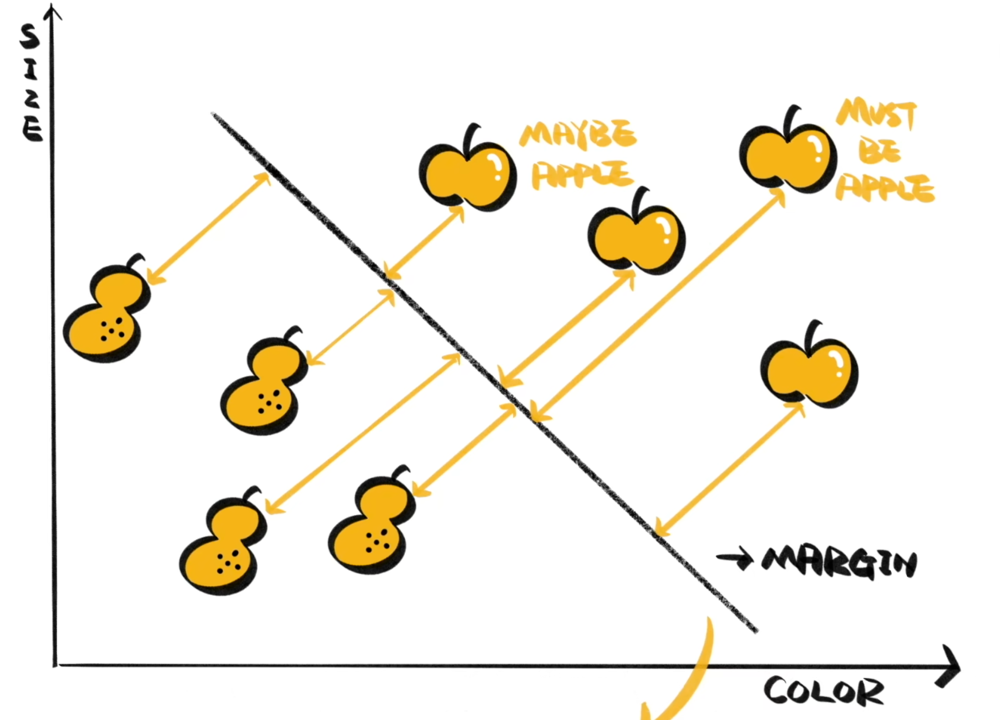

支持向量机（Support Vector Machine, SVM）是一种用于分类和回归分析的监督学习模型。SVM 的核心思想是寻找一个最佳的决策边界（超平面），以最大化类别之间的间隔，从而有效区分不同的类别。

在二维空间中，超平面是将数据点分开的直线。在更高维度下，它是一个能够分割数据集的平面。SVM 的目标是找到一个能够最好地分隔各个类别的超平面。支持向量是位于超平面边界上的数据点，这些点对边界的位置和方向起到了决定性的作用。间隔是指从超平面到最近支持向量的最短距离。SVM 最大化这个间隔，以达到更好的分类效果。

在许多实际问题中，数据可能不是线性可分的，因此 SVM 使用核函数（Kernel Functions）将数据映射到更高维度空间，在这个空间中，数据可能是线性可分的。常用的核函数包括：

- 线性核（Linear Kernel）：适用于线性可分的数据。
- 多项式核（Polynomial Kernel）：能够处理多项式关系。
- 径向基核（RBF Kernel）：常用的高斯核，适合处理非线性数据。
- Sigmoid 核：常用于神经网络。
