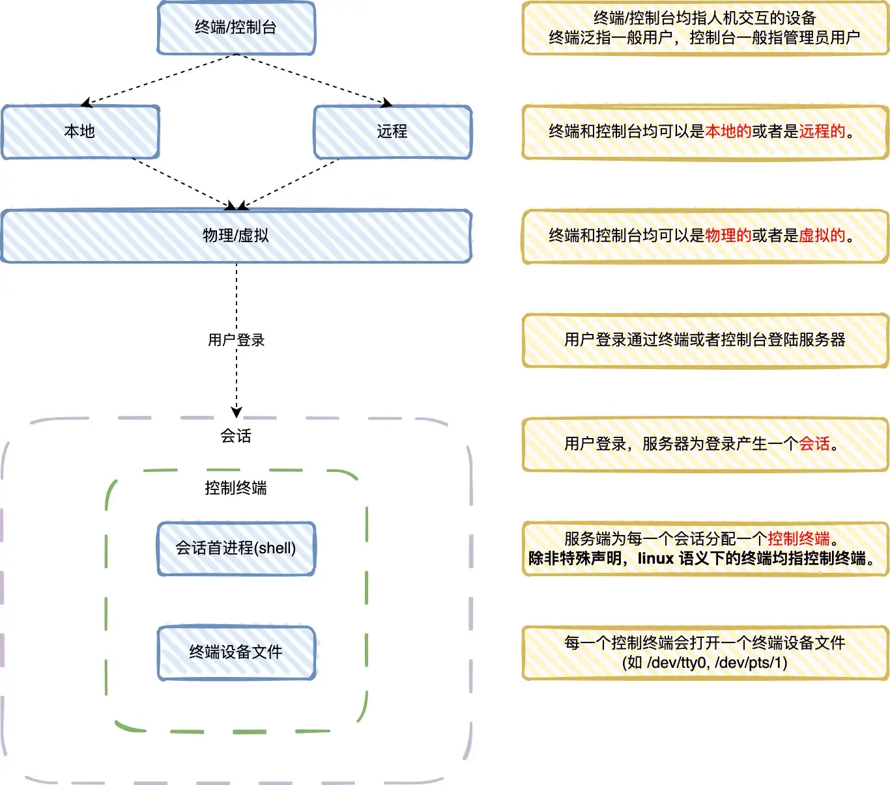

# 多用户系统与会话

在我刚学 Linux 的时候，就听过了这样的一句话：

> Windows 是单用户系统，而 Linux 是天生的多用户系统

当时的我其实是没有仔细思考这段话的。到底这两者的区别在何处？作为一个个体（而不是一个群体），似乎很难发现二者的区别。

从客观事实描述，就是 Windows 同一时间只能有一个用户，如果希望切换用户，那么需要先将当前的用户登出（logout），然后再登录（login）一个新的用户；而 Linux 系统可以同时有多个用户。为了更好的描述一个多用户的系统，我们引入了会话（session）的抽象。所谓的单用户系统，就是同时只能支持一个会话的系统，而多用户系统，就是同时可以支持多个会话的系统。

所谓的会话，就是指一个用户从登录系统，到登出系统的整个生命周期。我个人感受， **对话之于用户，就好似进程之于程序** 。

# 会话的资源

会话作为一个抽象，有自己独立的资源，大致有如下几种：

## 终端 TTY

从 [[Console, Terminal, TTY]] 里我们得知，tty 的语义就是“一套交互 IO”，这是天然和多用户紧密联系在一起的。因为每个用户为了能够和系统进行交互，就必须独立拥有一套交互 IO 设备，如果只有一个 tty ，那么显然多用户也是没有必要的。

所以每个会话都会有一个自己的 tty （并不绝对），会话所拥有的 tty 又被称为控制终端，它会在 `/dev/` 或者 `/dev/pts/` 下生成一个终端设备文件。

会话的开始往往是通过调用 `getty` 程序来完成的，这个命令就是获得一个 tty 终端的意思。我们需要先获得一个控制终端，然后再进行登录等后续事宜。

## 用户权限

正如进程之间需要彼此隔离一样，会话之间也需要彼此 **隔离** 。会话隔离的方式就是让它通过 **登录和登出** ，使得其生命周期里紧紧绑定一个特定用户的权限。在会话里进行的所有操作，本质上都是与之绑定的用户的操作。

具体实现而言，操作系统的用户信息存储在 `/etc/passwd`, `/etc/group` 等文件中，通过登录使得会话拥有了 `User ID`, `Group ID` 等属性，而文件系统对每个文件都用 `inode` （这既是一个 Linux 的数据结构，也是磁盘文件系统的存储文件元数据的结构）记录着文件所属者的 `uid`, `gid` 并记录着 `3 X 3` 的访问权限。这样一个会话就可以根据自身的 `uid`, `gid` 和文件系统的要求，来判断哪些文件是可访问的，哪些是不可访问的。多会话的隔离性也就得到了保证。

会话创建流程如下图所示：

## 进程组

会话还有一个更加浅显的理解，那就是“进程组的集合”。这并不奇怪，进程确实应该具有会话属性（其实是用户属性），不然多用户系统的各种进程该如何区分，一个进程的输出结果，到底应该输出到哪个 tty 上？一个进程使用和创建的文件，到底是谁的文件？这些问题都需要通过将进程划分给不同的用户来解决。

至于为什么会话不直接是“进程的集合”而必须得是“进程组”的集合，这是因为[[Process Group]]同样是 Linux 提供的能够更好的管理进程的工具，会话拥有进程组而不是进程，也提高了会话对于进程的管理能力。

会话只能有一个前台进程组，可以有多个后台进程组。前后台的区别在于，前台进程是有交互式 IO 的，用户通过 tty 和它们交互，而后台作业则没有这种交互关系。

进程组角度下的会话的结构如下：

## 资源的释放

当用户登出的时候，会话所拥有的资源会释放，示意图如下：

# 非登录会话与守护进程

并不是所有的进程都属于某个用户。对于守护进程而言，它们在逻辑上并不依赖某个用户去启动，也不专属于某个用户。而在具体的实现上，每个守护进程都属于一个“非登录会话”，非登录会话有以下特点：

| 属性 | 登录会话 | 非登录会话 |
|----|----|----|
| 会话首进程 | 通常是 shell 进程 | 调用 `setsid()` 的进程 |
| 会话 ID | 有，通常是会话首进程的进程 ID | 有，通常是会话首进程的进程 ID |
| 控制终端 | 有 | 没有 |
| 终端设备文件 | 有，例如 `/dev/pts/0` | 没有 |
| 前台任务组 | 最多一个 | 没有（除非重新分配控制终端） |
| 后台任务组 | 任意多个 | 有，通常是会话首进程的进程 ID |
| Client 挂断的影响 | 会话终止，所有进程被杀死 | 不受影响，继续运行 |
| 启动方式 | 通过登录终端启动，如 SSH | 通过进程调用 `setsid()` 创建 |
| 典型用途 | 用户交互会话，提供命令行接口 | 守护进程和服务进程，脱离终端运行 |
| 是否有默认 IO | 有，通常为终端设备 | 无，需要自行管理 |
| 示例 | 通过 SSH 登录，启动 bash | daemon 或后台服务进程 |

守护进程的创建需要经过两次 `fork()` ，其目的在于通过两次 `fork()` 彻底剥离非登录会话的各种“不必要”的资源，比如说控制中断 tty 。

其流程如图：

此外创建守护进程的注意事项还包括：

- 两次 `fork()` : 创建守护进程的标准方法是首先调用 `fork()` 创建子进程，然后在子进程中调用 `setsid()` 创建新会话，从而脱离控制终端，然后子进程再次 `fork()` 创建孙进程，保证孙进程不会再有权限打开控制终端。两次 `fork()` 的核心点都是避免让进程收到控制终端的影响。
- 关闭不必要的文件描述符: 子进程应关闭它继承的所有不必要的文件描述符，或重新定向标准输入输出（通常定向到 `/dev/null` ）。
- 改变工作目录: 常见做法是将当前工作目录改变到根目录，这样可以避免守护进程阻止其它文件系统的卸载。
- 处理信号: 对信号进行适当处理，特别是那些可能因为用户操作而意外终止守护进程的信号。
- 日志记录: 守护进程应有适当的日志记录机制，以便于跟踪状态和诊断问题。这也是一种对于守护进程不占有 tty 资源的补偿机制。
