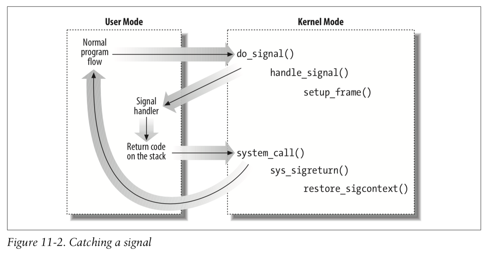

# 中断

Signal 是一种非常特殊的 IPC 机制，它只传递一个 `signum` ，用户程序会根据 `signum` 的不同来执行不同的函数。

这个功能是不是听上去有些耳熟，是的，它和 [[Interrupt]] 简直一模一样。中断号是由设备发送的，CPU 会根据中断号调用不同的选择不同的 handler； `signum` 由其他进程发送，用户进程会根据 `signum` 选择不同的 handler 。

# 实现

Linux 在 Signal 实现上，也和 Interrupt 实现也类似。用户进程进入内核完成某个 syscall 返回用户态前，先检查一下有没有给这个进程发送的 signum ，如果有的话，就将 `PC` 设置成 handler 的入口，返回用户态处理 signal ，在处理完 signal 后再回到内核，然后再回到用户态系统调用结束处。流程如下所示：

但是这种实现方式是存在问题的，即信号处理是可以被嵌套的，在 handler 中可以使用 syscall ，而使用 syscall 就有可能导致进入新的 handler ，这两个 handler 在同一个执行流中，所以同样存在可重入问题。

也就是说，signal handler 同样是需要可重入的。
