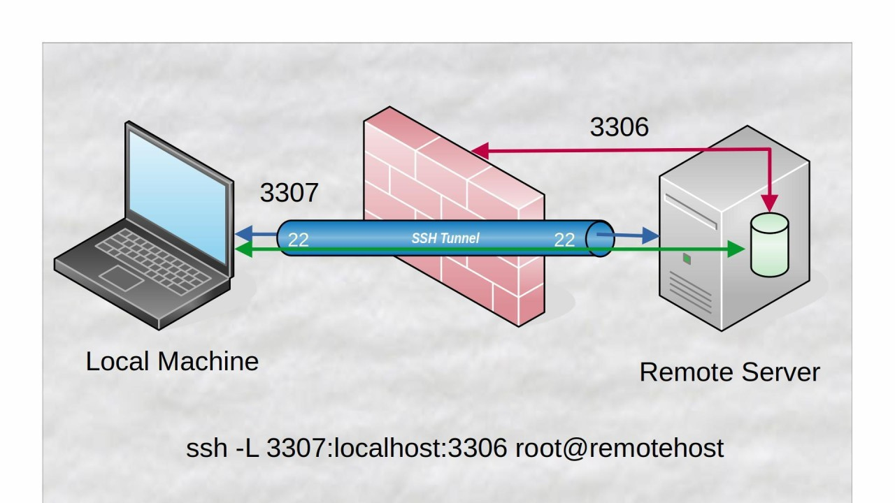

# 特点

ssh (Secure Shell) 为用户连接远端服务器的 shell 提供了安全的环境。

ssh 具有 2 个特点：

- 基于[[非对称加密]]的安全认证，所以相比传统的网络服务程序，如 FTP、POP、Telnet 要更加安全。
- 传输的数据是经过加密的，中间人攻击无效。
- 传输的数据可以是经过压缩的，所以可以加快传输的速度。

在 Linux 上，客户端直接使用 `ssh` 即可，服务端需要安装 `openssh` ，Windows 用户端需要安装 Putty 。

# 免密登录

ssh 如果不进行配置的话，在每次连接的时候需要输入密码，这是非常麻烦的，我们可以采用非对称密钥的方式来进行免密登录。其核心思路是在 server 上存储公钥来对用户身份进行验证。需要强调的是，并不是必须要进行这样的设置。

ssh 提供基于非对称密钥的安全认证。客户端将将公钥上传到服务器。登录的时候，客户端向服务器发送登录请求；服务器收到请求后，向用户发送一段随机字符串；用户用自己的私钥加密后，再发送回服务器；服务器使用事先存储的公钥进行解密，如果解密成功，证明用户可信，允许登录。

客户端使用如下命令生成密钥

``` shell
ssh-keygen
```

当然我们一般使用的时候会带一些参数：

| 参数   | 含义                  |
| ---- | ------------------- |
| `-t` | 加密方法，如 rsa, ed25519 |
| `-C` | 注释，会作为公钥的一部分，一般是邮箱  |
| `-f` | 文件名，指定密钥存放的路径       |

在密钥生成过程中，会出现如下字样

``` text
Enter passphrase (empty for no passphrase):
# Enter same passphrase again:
```

这里提到的 passphrase 是为了保护私钥的，如果有人窃取了你的私钥文件（黑掉了个人电脑），那么它就完全掌握通信过程了。passphrase 就是为了缓解这一情况，当存在 passphrase 的时候，使用私钥前必须输入正确的 passphrase 。不过我们一般都为了方便，不设置 passphrase 。

在公钥生成好后，需要将公钥附加到服务器用户目录下的$HOME/.ssh/authorized_keys` 文件中，这个动作可以用如下命令完成

``` shell
ssh-copy-id username@remote_host
```

当然在 [[Github]] 或者 Gitlab 中是在图形界面中添加的，原理是类似的，如果我们希望访问 Github 的服务器，我们就要把自己的公钥上传给 Github 服务器。

当我们基于 ssh 使用 `git clone` 时，我们的用户名是 `git` ，这是一个神奇的现象，我在 stackoverflow 上找到了这篇[帖子](https://stackoverflow.com/questions/47664768/why-does-git-using-ssh-use-git-as-a-username) 。我没有太看懂，但是我猜测是真正完成功能的用户就是 `git` ，它是某种中间人？

# 命令

ssh 命令格式如下

``` shell
ssh username@remote_host
```

参数如下：

| 参数 | 格式                                         | 含义                 |
|------|----------------------------------------------|----------------------|
| `p`  | `-p 2222`                                    | 使用服务器的特定端口 |
| `i`  | `-i path/to/key_file`                        | 使用特定私钥         |
| `t`  | `-t command command_arguments`               | 执行命令             |
| `T`  | `-T`                                         | 禁用了伪终端的分配   |
| `-J` | `-J username@jump_host username@remote_host` | 通过跳板机连接       |

`scp` 命令用于在服务器和客户端间传递文件，它的参数既有 `ssh` 的一面，也有 `cp` 的一面

``` shell
scp remote_host:path/to/remote_file path/to/local_directory
scp -r remote_host:path/to/remote_directory path/to/local_directory
```

`sftp` 会启动一个交互式的、安全的 [[Ftp]] 服务器，如下所示：

``` shell
sftp remote_user@remote_host
# Transfer remote file to the local system
get /path/remote_file
# Transfer local file to the remote system
put /path/local_file
```

# SSH Config

我们可以看到 `ssh` 命令可以有非常复杂的参数，比如说我们指定特定的密钥，再使用一个跳板机，那么就会是命令很繁琐，我们可以将这些参数记录在 `~/.ssh/config` 中，比如这样的

``` conf
Host sshtest
    HostName ssh.test.com
    User user
    Port 2200
    IdentityFile ~/.ssh/id_rsa_test
    ProxyCommand ssh -q proxyuser@proxyhost -p proxyport nc %h %p
```

它等价于：

``` shell
ssh -o "ProxyCommand ssh -q proxyuser@proxyhost -p proxyport nc %h %p" -p 2200 -i ~/.ssh/id_rsa_test user@ssh.test.com
```

# SSH Tunnel

关于隧道的概念，可以参考 [[Tunnel]] 。SSH Tunnel 本质是一种端口转发（Port Forwarding）技术。

SSH Tunnel 有 3 种：

## Local Port Forwarding

当 Client 需要访问位于 Server 上的资源或服务，但由于防火墙设置、网络配置或专用网络限制而无法直接访问时，就会使用本地端口转发。示意图如下：



命令如下：

``` shell
ssh -L [local_port]:[destination_address]:[destination_port] [username]@[ssh_server]
```

其效果就是，原本在 server 上私有的 `destination_port` ，现在 client 可以通过直接访问本机的 `local_port` 来获得服务。

## Remote Port Forwarding

Remote Port Forwarding 也被叫做反向隧道（Reverse Tunnel），让 Server 可以访问 Client 上的私密资源，相当于绕过 client 的防火墙，命令如下：

``` shell
ssh -R [remote_port]:[destination_address]:[local_port] [username]@[ssh_server]
```

此时 server 可以通过访问 `remote_port` 来访问 client 的 `local_host` 。

## Dynamic Port Forwarding

动态端口转发（Dynamic Port Forwarding）是一种将 Client 当作 Server 的 [[Proxy]] ，直观的效果就是 server 可以用 client 的梯子了。命令如下：

``` shell
ssh -D [local_port] [username]@[ssh_server]
```

# Server 限制密码登录

在 `/etc/ssh/sshd_config` 中增加如下配置即可：

``` conf
PasswordAuthentication no
AuthenticationMethods publickey
```
