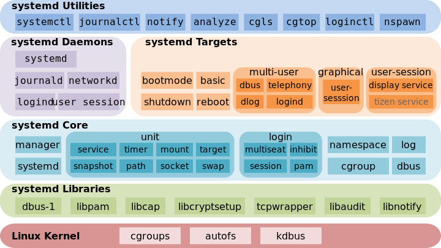

Systemd 是新一代的 init 程序。

# 命令

## `systemctl`

`systemctl` 主要用于管理 service 。大概有 4 个用法：

首先是启用/禁止 service ，启用后的 service 不会立即生效，但是如果开机，那么就会自动启动。其本质是在 `/etc/systemd/system/` 中建立符号链接：

``` shell
# 激活开机启动
sudo systemctl enable apache.service
# 取消开机启动
sudo systemctl disable apache.service
```

然后是对于 service 状态的转换，命令如下：

``` shell
# 立即启动一个服务
sudo systemctl start apache.service
# 立即停止一个服务
sudo systemctl stop apache.service
# 重启一个服务
sudo systemctl restart apache.service
# 杀死一个服务的所有子进程
sudo systemctl kill apache.service
```

再然后是对于 servie 的信息展示，命令如下：

``` shell
# 对 service 状态的打印，最为全面和常用
sysystemctl status bluetooth.service
# 显示某个 Unit 的指定属性的值
systemctl show -p CPUShares httpd.service
# 设置某个 Unit 的指定属性
sudo systemctl set-property httpd.service CPUShares=500
```

最后是对于配置文件的管理，命令如下：

``` shell
# 打印一个服务的配置文件
systemctl cat apache.service
# 重新加载一个服务的配置文件
sudo systemctl reload apache.service
# 重载所有修改过的配置文件
sudo systemctl daemon-reload
```

## `journalctl`

日志是 systemd 的一个重要功能，这是因为 daemon 进程并不和 tty 关联，所以所有的输出都会被重定向到日志中。

`journalctl` 命令用于打印和过滤 service 的日志。systemd 的日志是二进制格式存储的，所以 `journalctl` 还有解码二进制日志的作用。

我们常用如下命令：

``` shell
journalctl -xe -u apache.service
```

其中 `-u` 用于指定特定的 service ，而 `-x` 表示只显示“错误”或“警告”的日志条目的解释消息。 `-e` 使输出直接滚动到日志的末尾。

## `systemd-analyze`

这个命令的重要性就没有那么大了，我个人感觉就是单纯看着玩玩儿：

``` shell
systemd-analyze             # 查看启动耗时
systemd-analyze blame       # 查看每个服务的启动耗时
systemd-analyze critical-chain      # 显示瀑布状的启动过程流
systemd-analyze critical-chain atd.service # 显示指定服务的启动流
```

# 配置文件

## 文件组织

Systemd 的配置文件统称为 Unit 采用 INI 格式。它们通常被放在 `/lib/systemd/system/` 中，并用符号链接到 `/etc/systemd/system/` 中。

Systemd 的配置文件名格式主要有两个需要注意的，第一个是后缀名，它暗示了 Unit 的类型，比如 `.service, .target, .socket` 等；另一个是 `@` 符号，它表示某个“Unit 模板”（一种特殊的 Unit）的实例。

## Service

Service 就是最为正常和普遍的配置文件，一个典型的配置文件形式如下：

``` conf
# 描述服务的元数据和依赖关系
[Unit]
Description=My Nginx Service # 服务的描述
Requires=network.target # 服务的依赖，在 network.target 后才可以启动
After=network.target # 服务的启动顺序，要在 network.target 后

# 描述服务的启动、停止和重启行为
[Service]
Type=forking # 服务的启动类型
ExecStart=/opt/nginx/sbin/nginx # 启动服务的命令
ExecStop=/opt/nginx/sbin/nginx -c stop # 停止服务的命令
Restart=on-failure # 定义服务失败时的重启策略
PIDFile=/var/run/nginx.pid # 指定服务的 PID 文件的路径，便于 systemd 监控

# 定义服务如何安装到目标中
[Install]
WantedBy=multi-user.target # 指定服务在哪些目标下启用
```

其中 `[service]` 的 `Type` 类型如下所示：

- simple（并不检测运行状态）
- forking（fork 后运行）
- oneshot（一次性运行，并不持久）

## Target

启动计算机的时候，需要启动大量的 Unit。如果每一次启动，都要一一写明本次启动需要哪些 Unit，显然非常不方便。Systemd 的解决方案就是 Target。

简单说，Target 就是一个 Unit 组，包含许多相关的 Unit 。启动某个 Target 的时候，Systemd 就会启动里面所有的 Unit。从这个意义上说，Target 这个概念类似于”状态点”，启动某个 Target 就好比启动到某种状态。

## Socket

`xxx.socket` 文件往往对应一个同名的 `xxx.servie` 文件。它定义了一个 socket ，它在有连接请求时自动启动与之关联的服务（就是同名的服务）。

示例如下：

``` conf
[Socket]
ListenStream=8080

[Install]
WantedBy=sockets.target
```

## Mount

Mount Unit 可以用于开机自动挂载设备。示例如下：

``` conf
[Unit]
Description=Mount NVMe partition to /home/xxx/hdd

[Mount]
What=/dev/nvme0n1p1 # 指定要挂载的设备
Where=/home/xxx/hdd # 指定挂载点
Type=auto           # 可以根据文件系统类型指定（如 ext4、ntfs 等），使用 auto 让系统自动检测。
Options=defaults    # 可以根据需要添加挂载选项

[Install]
WantedBy=multi-user.target
```

# 特点

## 快速启动

Systemd 的启动速度相比于之前的 init 程序要更快，这主要得益于两个方面：

- 并行启动：尽可能的并行启动多个服务。
- 懒启动：只在真正用到某个服务的时候，才启动这个服务。

并行启动需要处理好各个服务之间的依赖关系。懒启动和 IPC （IPC 和依赖关系有关）高度相关，Systemd 的 servie 依赖专用的 [[Socket]] 和 [[DBus]] 来完成，可以使得高级服务在真正使用基础服务的时候，才真正启动基础服务，而不是建立 IPC 通信之初，就启动基础服务。

快速启动的意义我现在还把握不太好，我目前觉得快速的启动速度更有利于 PC 上的操作系统。而对于 Server ，长时间不关机，似乎快速开机没啥必要，但是可能对于容器等[[Virtualization]]技术，快速启动是有意义的。

Systemd 的启动速度优化借鉴了 [[Launchd]] 的思路。

## 大一统

Systemd 负责的方面要比原先的 init 程序要更多。这也是它为人诟病的地方。

同时 systemd 的日志和配置格式要比之前的 init 程序要更加统一一致。

## 不可移植

Systemd 使用了许多诸如 CGroup 和 autofs 等 [[Linux]] 特有的机制，所以并不可移植到诸如 [[Unix]] 等系统上，这也是为人所诟病的一点。

# 原理

## 架构

这是我见过的最烂的一张架构图了：



它烂的原因：

- 将不同语义的概念放在了同一个等级，比如说 `systemd daemons` 和 `systemd targets` ， `unit` 和 `login` 。
- 冗余的东西太多了。

不过这幅图上还是有一些有意义的地方，比如它指出了在最底层，systemd 依赖于 linux 的 `cgroups, autofs, kdbus` 技术，再比如它指出了 unit 文件的 8 种类型，也指出了常用的 systemd 工具。

## 服务状态

如果用 `systemctl status` 查看 service 的状态，就会发现每个 service 存在 `Loaded` 和 `Active` 两种状态。

`Loaded` 用于描述描述服务的配置文件是否已被正确加载。具有以下状态：

- `Loaded` ：单元配置已加载。
- `Not-Found` ：单元配置文件未找到。
- `Error` ：加载过程中出现错误。

`Active` 用于描述服务的运行状态，具有以下状态：

- `Inactive` ：单元未激活。
- `Active` ：单元正在运行或已激活。
- `Activating` ：单元正在启动。
- `Deactivating` ：单元正在停止。
- `Failed` ：单元启动失败。

## Socket / D-Bus / AutoFS

Systemd 采用了多种技术用于实现懒加载。

Socket 可以用于懒加载，是因为使用 socket 进行 IPC 的进程，本质不是和对方进程在通信，而是在和 socket 进行通信。所以如果先创建 socket ，那么进程就并不需要等待另一个进程的启动。dbus 也是类似。

文件系统也同样可以懒挂载，有些 service 依赖于某些文件系统的挂载，autofs 允许我们假装已经挂载好了，只有等实际访问的时候才挂载。
