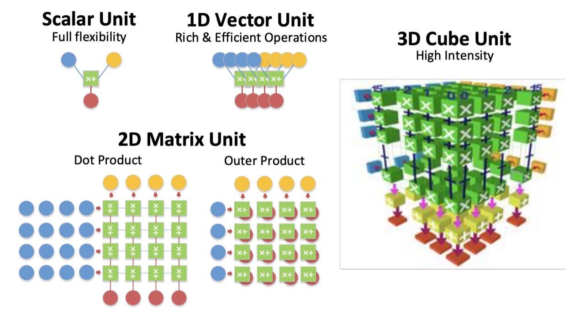
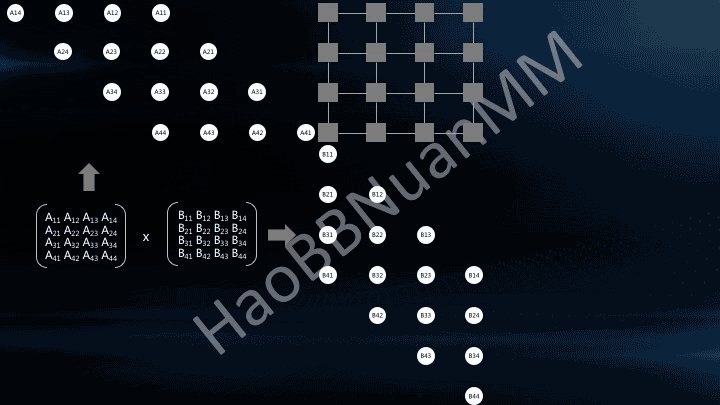
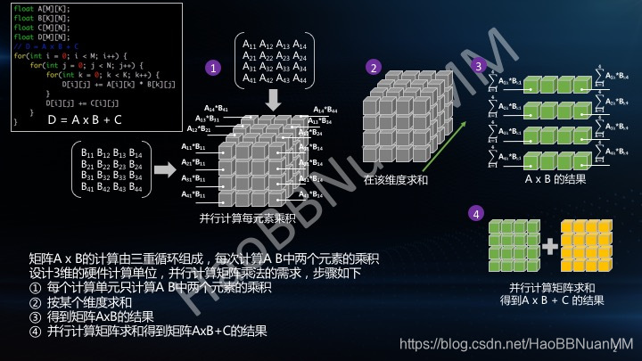
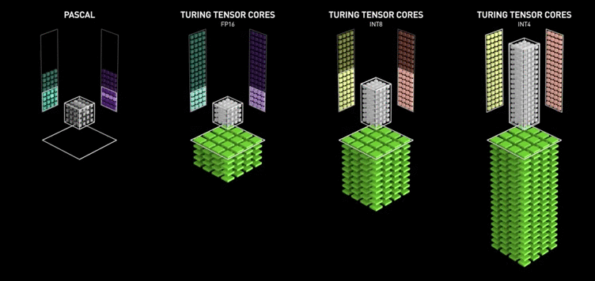

先放一张图：

# 脉动阵列

脉动阵列（Systolic Array）是一种 2D 的结构，它的 MAC 单元排布成一个二维矩阵的结构，来有效地平衡计算于通信。

# Tensor Core

Tensor Core 是一种 3D 结构，也就是说对于第 $(i, j, k)$ PE ，在其上发生的运算是 $a_{i, j} \times b_{j, k }$ ，这样一个 cycle 就可以把矩阵乘法中所有的乘法都计算完，剩下的 reduction 操作，就看各个 PE 之间的联系了。这么看 Tensor Core 是一种更加符合 [[Enisum]] 抽象的硬件。示例如下：

所以 Tensor Core 应该是比脉动阵列要快的。

另外还有一个酷炫的动图，演示的是 tensor core 在处理比自己规模大的矩阵时是如何分片的，此外我们也可以看到 Pascal 架构的 Tensor Core 是无法一次性进行乘法运算的（可能其他 tensor core 也不行，只是时钟频率提高了看不出来）：

