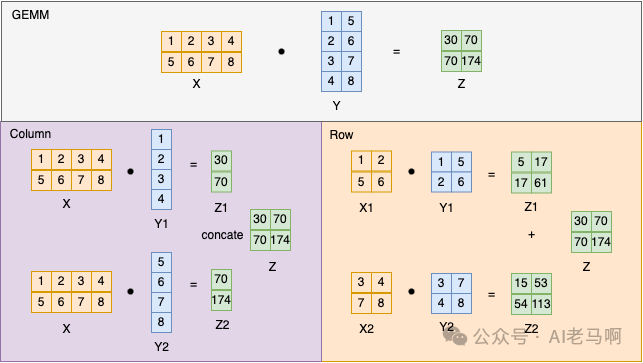
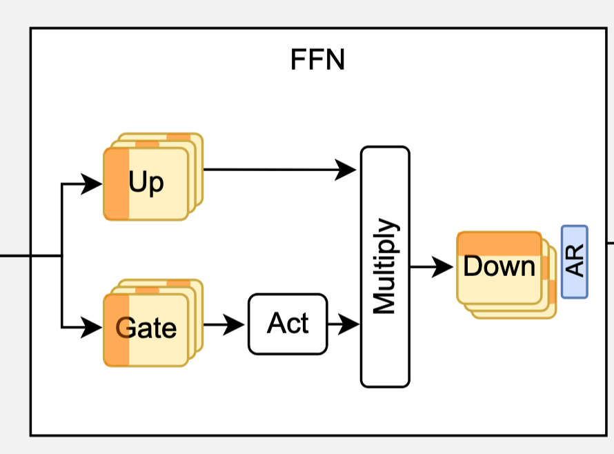

# TP 的优势

Tensor Parallelism ，本质是将模型沿非 layer 方向切割。这种切割方式会引入很多 Scatter-Reduce（Collective Operation） 导致的通信开销，因此 TP 往往是在一个 Node 内进行的，Node 内的 GPU 可以用 [[NVLink]] 这种高速互联联系在一起。

[[PP]] 可以理解为将模型竖向切割，那么在 Training 时， GPU 显存不够的情况下，我们到底应该选择 PP 还是 TP 呢？其实主要还是 TP，这是因为训练过程中使用 PP 是存在 Bubble 的，而 TP 则没有（不过引入了一定的通信开销）。而且部署 PP 需要考虑 MicroBatch 等参数，比较难配置。

那在 Inference 阶段呢？依然是用 TP ，这是因为 PP 就算没有因为 Backward 依赖导致的 Bubble ，也会因为 Inference 的 Batch Size 较小，而无法利用好流水线的问题，而 TP 则不会。

此外 PP 还有一个非常明显的缺点，那就是它没有办法改善 Latency（分成多个阶段并不会有延迟的降低，甚至还有所增加），只能改善吞吐，这使得它在推理用的应用并不多。

另外 TP 虽然名字起得很 general，似乎只要是且 tensor 的都可以叫 TP，但是实际上往往局限于对于模型权重的某个维度的切割，比如 [[CP]] 因为切割的是序列维度，而序列维度并不是模型权重的一个维度，因此不能算是一种特殊的 TP 。

# Column/Row Split

更进一步，对于权重矩阵 $W$ （它的形状是 $(d_{in}, d_{out})$）的情况，我们又可以沿着列切（column split）或者沿着行切（row split）两种方式。

> 记住这个 layout 很关键，因为只有“哪个维度是行，哪个维度是列”定下来了，column/row split 才有了讨论的意义。

Column Split 的本质其实是将 $d_{out}$ 进行一个切分，因此输入向量的维度并不会发生变化，而输出向量变成了原来输出向量的一些 channel ，我们如果希望得到最终的结果，那么还需要进行一个 concat 操作（在分布式中，是进行一个 AllGather 操作，具体可以见 [[Collective Communication Operations]]）

而 Row Split 的本质是对 $d_{in}$ 进行一个切分，因此输入向量的维度会被切分成几块，而输出的 channel 依然是 $d_{out}$ ，但是不再是最终结果了，而是一个 partial sum ，需要 accmulate 获得最终结果（在分布式中，对应一个 AllReduce 操作）

那么在 FFN 的两个 GEMM 运算中，我们是怎么做的呢？答案是对于 up 矩阵，我们使用 column split ；对于 down 矩阵，我们使用 row split 。

为什么要这样处理呢？其实我们有 4 种选择：

- row-row
- column-column
- row-column
- column-row

对于 row-row 来说，第二个 row 要求完整的 input ，而第一个 row 会产生一个 partion，这就在中间引入了通信。column-column/row-column 也是类似，都会在中间引入一次通信。

只有 column-row 在中间不会引入通信，第一个 column 产生的 output partion ，刚好作为第二个 row 的 input partion 。
