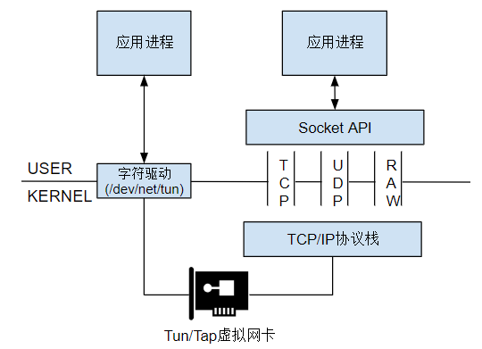
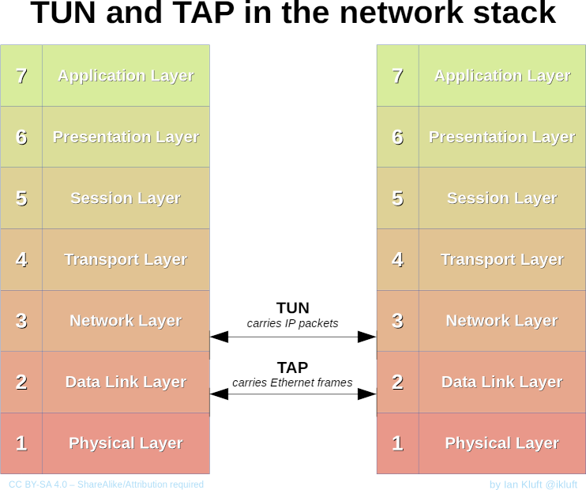
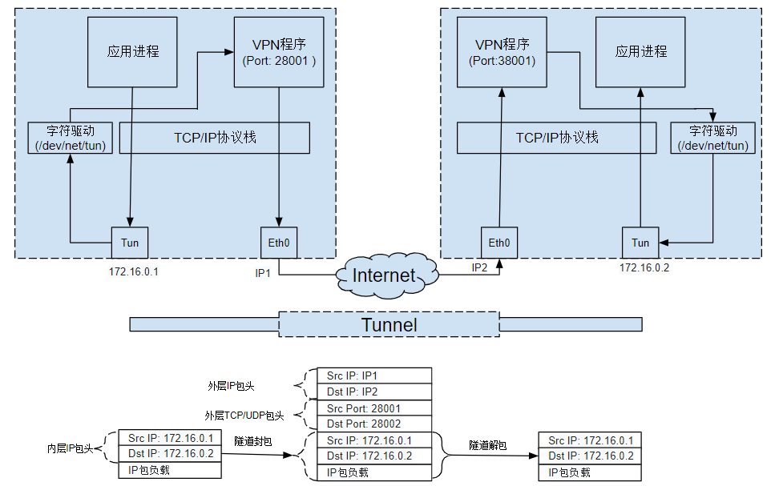

# 网卡不是一切

先讲个笑话：

> 虽然在 Linux 上“[[Everything is a File]]”，但是“[[NIC]]”不是“一切”，所以“网卡不是文件”。

这个笑话是为了嘲讽 Linux 并不认为网卡是文件，确实是这样的，在 `/dev/` 下是没有 `nic, eth, wlan` 之类的文件的。

不过虚拟网卡是一个例外，在 archlinux 上，确实有 `/dev/net/tun` 存在的。写入 `/dev/net/tun` 的数据会发送到虚拟网络接口中；发送到虚拟网络接口中的数据也会出现在该字符设备上。

# 虚拟网络设备

不同于普通靠硬件网路板卡实现的设备，这些虚拟的网络设备全部用软件实现，并向运行于操作系统上的软件提供与硬件的网络设备完全相同的功能。

TAP 等同于一个以太网设备，它操作第二层数据包如以太网数据帧。TUN 模拟了网络层设备，操作第三层数据包比如 IP 数据封包。

BTW ，TUN 是 Tunnel 的缩写，而 Tap 的全称非常难查，是 Terminal Access Point 的缩写。

# 隧道

使用 TUN/TAP 可以实现 [[Tunnel]] 。以 VPN 隧道为例，VPN Server 上有一个暴露在公网上的 IP ，如果想和私网 IP 通信，就需要让这个公网 IP 作为代理。

更具体来说，我们会先给这个公网 IP 发包，这个公网的包会被 VPN Server App 接收，然后将负载转发给 TUN/TAP ，TUN/TAP 上绑定的就是私网 IP ，其示意图如下：

