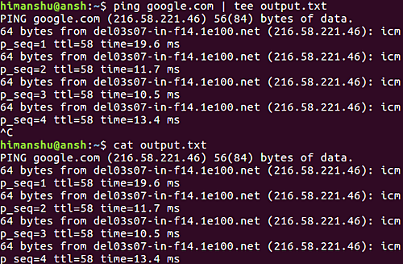
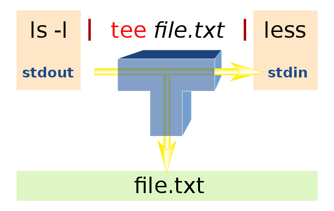

`tee` 是一个传统的管道增强命令。

在命令行中，如果我们希望将 `stdout` 记录到一个文件 `output.txt` 中，那么我们就可以把它用 `>` 命令重定向到 `output.txt` 中。但是这样存在一个问题，就是我们不再能从终端上看到输出了。

`tee` 就是用于解决这个问题的，它可以读取 `stdout` 并且将其保存到文件的同时，还在屏幕中显示，如下所示：

```shell
ping google.com | tee output.txt
```

下面的截图展示了这个输出内容不仅被写入 `output.txt` 文件，也被显示在标准输出中。



`tee` 这个名字就是 “T” 这个单词，它形容的是 `tee` 的工作原理：
