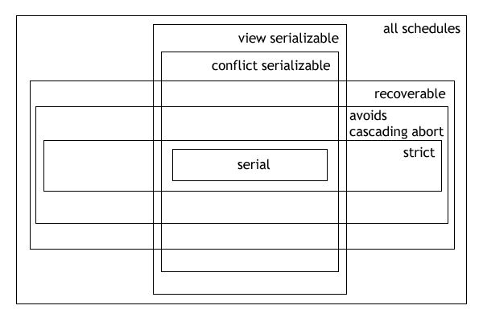

# Serializability

所谓的 Before-After，强调的是事务的“原子性”，一个事务要么在另一个事务的前面（Before），要么在事务的后面（After），不能交叉执行（interleaved）。这种方式被称作 Serial 串行。

而这种完全保证串行和原子性的方式是非常低效的，所以在实现上，我们往往是允许不同事务里的操作（Operation）交错执行的（不再保证原子性）了，但是这种方式往往会导致一些一致性问题，而我们能做的，是认识到不同模型对于不同强弱的一致性的保证。 在开始介绍之前，需要先明确一些概念：

Operation ⊂ Transaction ⊂ Schedule

也就是一个调度（Schedule）就是一个“历史记录”，这段历史记录里有所有事务（Transaction）里的所有 Operation 的排列顺序。数据库开发者能做得就是“歪曲” Schedule 来获得性能，而用户需要明确被开发者歪曲过的 Schedule 和一个理想的 Schedule （一般就是原子性事务形成的 Schedule）之间的差距有多大。

我们用 Grid Notation 来形象表示上述概念，如下图所示：

此图中有 3 个 Schedule，每个 Schedule 有 2 个 Transaction，每个 Transaction 有多个 Operation，位于相同行的 Operation 并行执行。

所谓的 Serializability 可串行化性，指的是被歪曲的 schedule 导致的结果（storage system 的状态），和某个一个完全串行化的结果是相同的。

可串行化是最为宽松的状态，而实际上，这种宽松并不能为 scheduler 提供指导，我们并不指导如果将某个 Operation 放到另一个 Operation 之前，是不是会就会导致错误，所以在实践中，我们引入了 Conflict Serializability 和 View Serializability。

Conflict Serializability 的思想非常简单，说得是如果一些操作如果同时 access 同一个资源，并且有一个 access 是写，那么就认为这些操作是 conflict 的，那么这些 operation 就不能并行。基于这种方式获得的调度是符合 Serializability 的，被称为 Conflict Serializability。

Conflict Serializability 的约束还是过强了，类似于 CPU 指令的调度，RAW，WAW，WAR 都会被判定为 conflict，而实际上约束并不需要这么强。View Serializability 就是一种较为理想的状态，它一共有 3 点要求，其中第二点就是 RAW，而剩下两点是关于 init 和 end 的约束，就比 Conflict Serializability 要更加合理地多。

在实际生产过程中，我们常常使用 Conflict Serializability，这是因为这种比较好实现。

