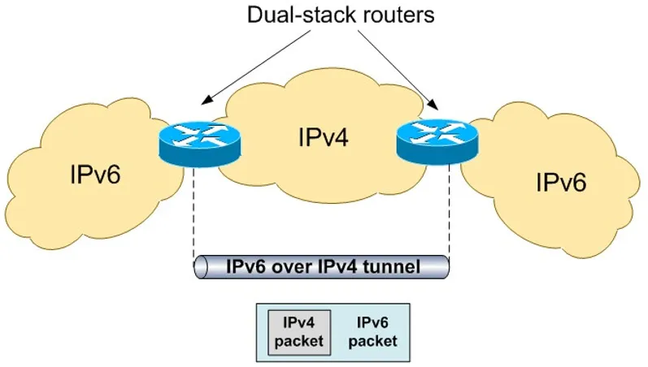
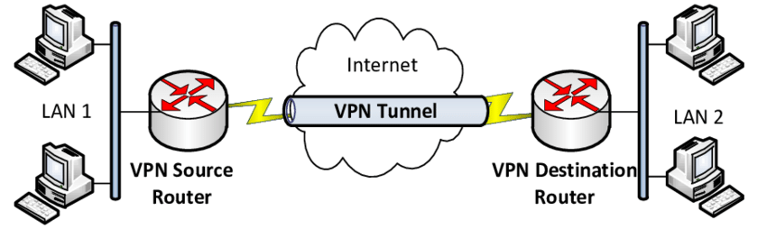

# 总论

> 当我们遇到一座山时，常规的方法是从山路上翻过去。当遇到没有山路情况，看似束手无策，实际上我们还可以走隧道。

隧道（Network Tunnel），就是将原本网络不支持的网络包，借助网络原本支持的机制来发送。“不支持”的原因有多种，“借助”的方式也有多种，“原本支持的机制”还是有很多种。下面会讲一些例子来具象化这种抽象概念。

总的来说，Tunnel 有如下作用：

1.  在不兼容的网络上传输数据
2.  在不安全网络上提供一个安全路径
3.  隐藏私有的网络地址

# IPv6 隧道

目前的趋势是 IPv6 代替 IPv4 ，想要发展 IPv6 存在一个困难，就是有可能有些区域网络只有 IPv4 而没有 IPv6 ，那么一个 IPv6 的网络包就无法通过这种不支持 IPv6 的网络。

我们可以采用 IPv6 隧道技术来解决，其示意图如下：

其实现就是在 IPv6 网络包外再封装一层 IPv4 的包头，然后用 IPv4 协议栈进行传播。

# VPN 隧道

VPN (Virtual Private Networks) 其实本质上是一种提供公网 IP 访问私网 IP 的安全方式。其示意图如下：

其实现机制就是在私网上启动一个 VPN Server ，这个 Server 同时暴露在公网上，我们用隧道连接这个 Server 并让它作为 [[Proxy]]（是一种正向代理），进而访问私网里的其他机器。

VPN 隧道的安全性非常重要，不然就是谁都可以连接 VPN Server 了。其次，使用 VPN 隧道可以隐藏 client 的 IP ，私网里的机器会认为发送者的 IP 是 VPN Server 的 IP 。

不过我们经常遇到的 VPN 其实是“梯子”，它并不被用来访问某个私网，而是被用来“翻墙”，其原理也是类似的，如下所示：

# SSH 隧道

SSH 隧道和 VPN 隧道的设计很类似，都是为了借助一个代理来安全地访问其他私有资源。其不同在于，VPN 隧道是借助一个 IP 代理来访问私有 IP ，而 SSH 隧道是借助 22 号端口代理（SSH 的默认端口）来访问其他不公开暴露的其他端口。所以 SSH Tunnel 也叫做 SSH Port Forwarding 。

示意图中展示了当 3306 端口被 FireWall 禁止暴露后，我们可以在 22 端口处建立一个隧道，然后再访问 3306 端口上。

不过如果考虑到 [[NAT]] 技术，“端口”不再局限于当前 Server ，而是有可能代表其他 Server ，那么 SSH 隧道可以接触的资源就更多了。

SSH 隧道除了支持正向代理外（client 访问 server 的 private port），还支持一种“反向代理”（server 可以访问 client 的 port），我们可以使用这种方法让 server 使用我们自己笔记本上的梯子。
