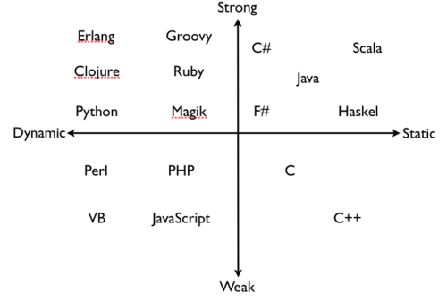

# Static vs Dynamic

静态语言（Static）和动态（Dynamic）语言的区别在于变量类型是何时被确定（或者说何时被检查的）的。

静态语言的类型是在编译时被确定的，我们需要在编译前就指出每个变量的类型是什么。静态语言又可以分为两类：

- Manifest Type: 必须清楚的宣告每一个变量的类型，比如说 [[C]] 语言，变量前面就是类型。
- Inferred Type: 允许编译期进行一些变量的类型推断，比如说 [[Rust]] 和 [[C++]] 的 `auto` 关键字。

动态语言的变量的类型是在运行时它被第一次赋值时确定的，并且允许它在运行时改变类型，比如说 [[Python]] 。

# Explicit vs Implicit

强（Explicit）类型语言和弱（Implicit）语言的区别在于弱类型语言允许类型的 **“隐式转换”** 。从这个角度看，我们发现 Rust 是最“强”的类型语言，因为它连 `i32` 转 `i64` 都不会同意。相比之下 C 和 C++ 允许许多隐式类型转换，甚至允许一些不符合内存布局的转换，比如浮点数转整数：

``` c
#include <stdio.h>

int main() {
    float b = 3.14;
    int a = b;
    printf("a = %d\n", a); // a = 3
    return 0;
}
```

因此它们是弱类型语言。

Python 一般被视为强类型语言，虽然类似的上文 C 的隐式转换逻辑在 Python 中也行得通：

``` python
b = 3.14
a = b + 1 # int `1` implicit to float
print(a) # 4.14

c = 1
c = 3.14 # just a rebind
```

但是对于更加复杂的类型，就是行不通的了，比如说：

``` python
b = "hello"
a = b + 1 
```

会报错：

``` text
TypeError: can only concatenate str (not "int") to str
```

可以看出 python 是由严格的 type 检查机制的，上面例外可能是 python 的语法糖。

而 [[Javascript]] 是弱类型语言，比如下面的例子是成立的：

``` javascript
let value = "hello";
value = value + 1; // value = "hello1"
```

# 总结

其实这里记录的只是一种说法，有可能还有其他定义，总之从根本上把握不同语言设计的倾向性即可。

最后放一张图总结：


