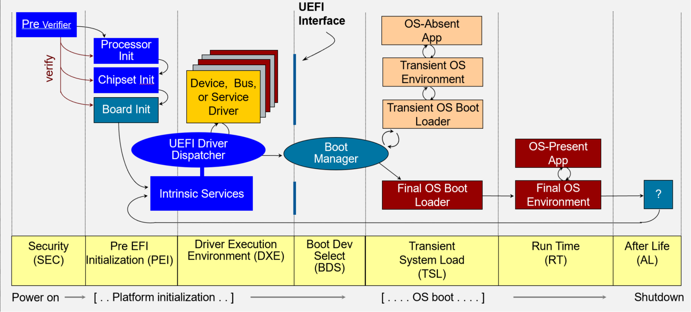
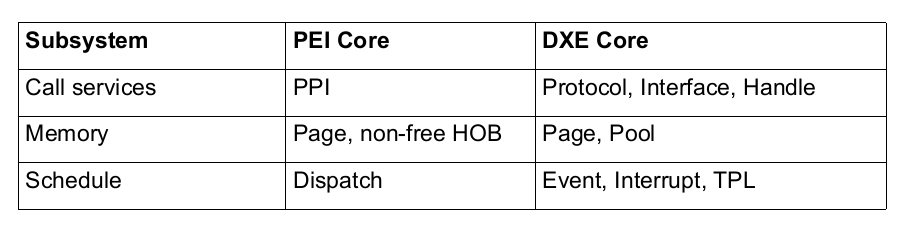
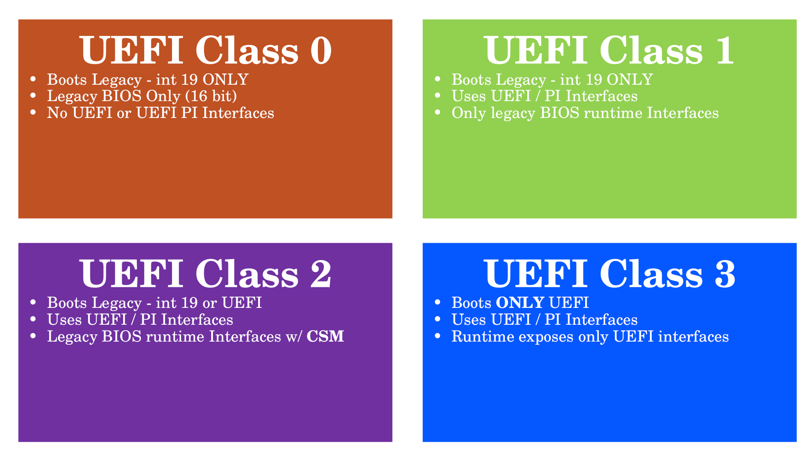

# ESP

UEFI 是相比于 [[BIOS]] 更加先进的固件，它不再局限于寻找 [[MBR]] ，而是可以直接加载外存上的 EFI 文件（这些文件往往就是bootloader）。

UEFI 有专门的 ESP (EFI System Partion) 来存储启动相关的文件和数据，这在 Linux 上就是 `/boot/` 目录，如果用 `lsblk -f` 去查看，就可以看到相关显示，会发现这个分区的文件系统是 [[FAT]] ，这主要是为了提高跨平台兼容性。

在 ESP 中存放着：

- bootloader: 如 [[Grub]]
- 内核镜像：比如说 `/boot/vmlinuz-linux`
- bootloader 的配置文件等

# Boot Flow

UEFI 的启动流程如下图所示：

## SEC

使用汇编，因为没有栈，所以无法使用 C 语言。

在这个阶段它将 Cache 初始化为临时内存，因为没有内存就没有栈，就无法使用 C 语言，工程的可维护性就会变差。

而内存并不能轻易初始化，所以我们会选择用 Cache 先当作内存，但是也需要一定的特殊配置。

## PEI

在 PEI 阶段我们会对内存进行初始化，并进行一些其他简单的平台初始化任务（比如说 GPIO, Serial）。

PEI 会真正初始化内存，而原本内存的数据在 cache 中，这时候就需要重新执行一遍 PEI 阶段，将数据从 cache 搬运到内存中。

PEI 就开始引入模块化的设计，具体而言就是，存在一个 PEI Core 用于调度多个模块，PEI 阶段的模块被称为 PEIM 。调度使用的是在同一上下文顺序调度（要检查依赖关系），依赖函数指针。模块间通信的接口被称为 PPI 。

## DXE

在 DXE 阶段我们拥有了完整的内存，可以执行更加复杂的功能了（如网络，解码）。

正因为功能更加复杂了，所以我们需要更加复杂的协调机制。在 DXE 中我们同样采取“Core + Module”的方式，不过我们这次 enable 了 time interupt ，所以可以支持一些 Device Notify 。

DXE 和 PEI 的对比如下：

## BDS

在这个阶段我们选择要在哪个外存上 boot 操作系统。

## TSL

这可能是一个可选的阶段，我们进入这个阶段，一般是因为 OS 启动不了了，这个阶段是一个紧急救援阶段。

# System Manage Mode

这是一个比 ring-0 权限还高的处理模式，而且对 OS 完全透明（避免了恶意的 OS）。主要用于处理一些和硬件密切相关的任务。

它实现了一组 handler ，当发生 SMI （SM Interupt）的时候，会选择一个 handler 进行执行。它执行在一片特殊的内存 SMRAM 中，这片内存对 OS 完全不可见。

# UEFI System Class

根据 OS 对 UEFI 的适配程度（过去这些 OS 适配 BIOS），UEFI 将其分为 4 个 class ，如下所示：

