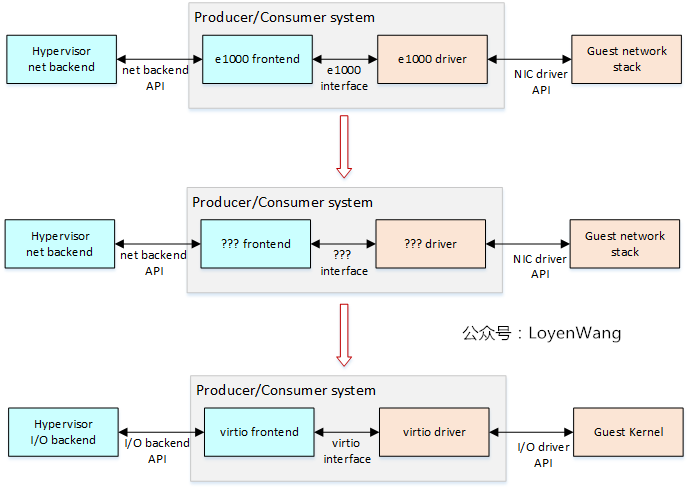
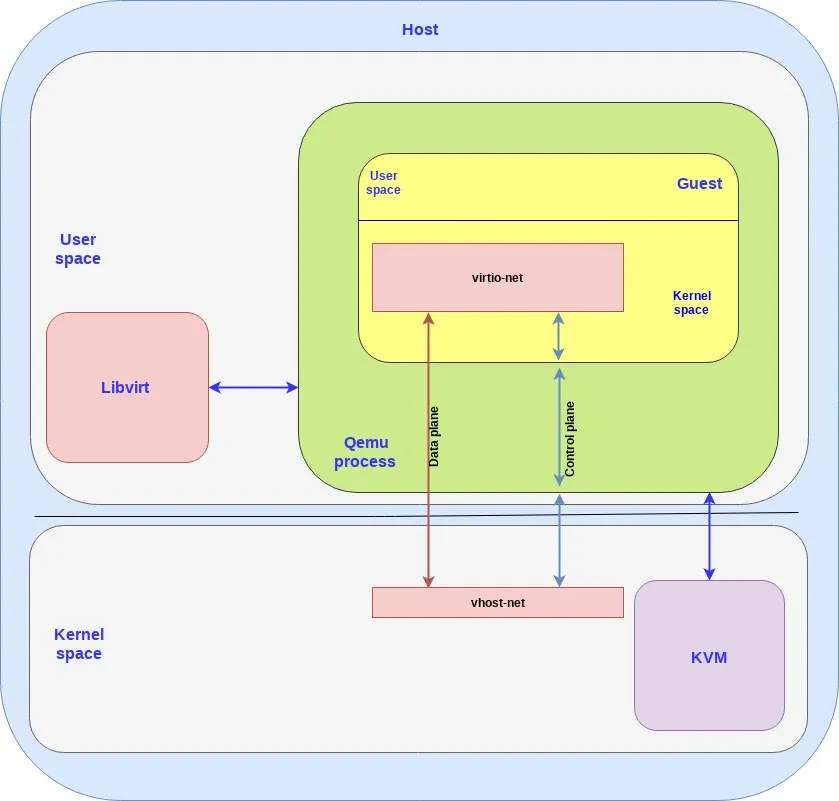

# 设备抽象

VirtIO 是一种半虚拟化设备的集合，广泛用于 [[Qemu]] 。

VirtIO 中有多种设备，其设备模型都是类似的。从具体的设备，到抽象的模型，有一个这样的演化过程：

# 半虚拟化

在 [[KVM]] 虚拟化中，一旦 VM 运行到一些设备访问（包括寄存器和内存）代码时，就会发生 `VM Exit` 交给 KVM ，而 KVM 则会 `return` 到 Qemu 中，由 Qemu 模拟设备行为，有些具体的设备功能（比如说发送网络包之类的），Qemu 会进行系统调用来通过 Kernel 使用 host 的设备资源。这个流程中会发生多个上下文切换，开销是非常大的。

如果采用全虚拟化设备的话，会存在如下问题：

1.  真实设备的状态往往都是存在寄存器中的，而每次对寄存器的访问，都会导致 `VM Exit` 等一系列上下文切换，过于频繁了。
2.  在数据生产和消费中（也就是数据平面中），VM 和 Qemu 的设备往往是同步的，VM 需要等待 Qemu 的工作完成。我不太清楚是不是真的是这样，可能是因为一些真实设备本身的通信协议的同步性就很强。
3.  Qemu 在生产或消费数据的时候，还是需要进行系统调用来切换入 Kernel 。

如果是半虚拟化设备的话，我们可以将这个这个设备抽象设计得更加符合虚拟化的要求，减少上下文切换的开销。Virtio 可以从如下方面入手：

1.  减少寄存器的数量。寄存器只用于 CPU notify 设备，而设备状态不要放在寄存器中，而是应该放在内存中，这样不用模拟那么多的寄存器。
2.  优化生产者-消费者模型：使用 ring 结构来实现生产者-消费者模型，这种数据结构的异步并行性非常好。
3.  引入额外的机制来缩短数据路径，使得数据平面可以绕过 Qemu ，直接用 Kernel 来模拟数据的生产。

对于第 2 点， `vring` 就是这个著名的 ring 结构。

对于第 3 点， `vhost` 协议就是这样的一种，如下所示，其中红色路径就是绕过来 Qemu 来提高性能，蓝色则没有绕过：

