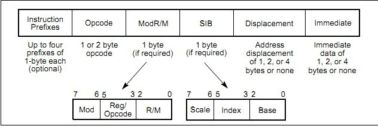

# 风格

X86 的汇编有两种风格，分别是 [[Intel]] 和 [[AT&T]] 风格。在 DOS/Windows 领域中，使用的是 Intel 风格的汇编；而在 Unix/GNU/Linux 领域，使用的是 AT&T 风格，这是因为最开始是 AT&T 在 80386 上移植了 Unix ，所以 Unix 这一系列生态就都使用了 AT&T 风格。

## 大小写

Intel 多使用大写字母，而 AT&T 使用小写字母。

## 操作数格式

对比如表

|            | Intel            | AT&T              |
|------------|------------------|-------------------|
| 寄存器     | `EAX`            | `%eax`            |
| 立即数     | `514`            |$514`            |
| 间接寻址 1 | `[EAX]`          | `(%eax)`          |
| 间接寻址 2 | `[EAX + 4]`      | `4(%eax)`         |
| 间接寻址 3 | `[EAX + EBX *4]` | `(%eax, %ebx, 4)` |

## 指令流顺序

为表示“将 eax 内容写入 ebx”，Intel 使用的是：

``` asm
MOV EBX, EAX
```

这种用法是和其他汇编或者 C 语言一致的，其思路是“EBX = EAX”的赋值操作。而 AT&T 则是：

``` asm
mov %eax, %ebx
```

这种思路和 shell 中 `cp, mv, ln` 等命令类似，其思路是“eax =\> ebx”。

## 操作数大小

在 Intel 中，是通过在内存单元的操作数前面增加 `[BYTE(8), WORD(16), DWORD(32), QWORD(64)] PTR` 来指定大小，如：

``` asm
MOV BYTE PTR [EAX], 0xFF    ; 将 0xFF 存储为一个字节
```

在 AT&T 中，通过在指令后增加 `b(8), w(16), l(32), q(64)` 来确定操作数大小，如

``` asm
movb (%eax),$0xff
```

## 远程跳转

Intel 使用 `FAR` 来表示远程跳转或者调用，如下所示：

``` asm
CALL FAR 0x1234:0x5678
```

而 AT&T 使用前缀 `l` 来表示远程跳转或者调用，如下所示：

``` asm
lcall 0x1234:0x5678
```

# 跳转和调用

`jmp` 和 `call` 都是控制流转移指令，其中 `call` 指令会将返回地址压入栈中（X86 没有 `ra` 这样的寄存器），而 `ret` 指令会将栈上的返回地址弹出并跳转。

近跳转指的是在代码段内进行跳转，而远跳转指的是跨段跳转。近跳转只改变 `IP` ，而远跳转不仅改变 `IP` 还改变 `CS` ，这并不奇怪，因为远跳转后如果 `CS` 不发生变化，那么就无法正确执行指令了。

因为内存平坦模型的存在，所以基本上没人再使用远跳转了。

# 指令编码

作为 CISC 指令集，指令编码形式还真是玄妙啊。指令编码格式如下：



太具体的我也没整明白，大概就是：

- Instruction Prefix 用于指定锁，重复，段，操作数大小，地址大小
- Opcode 用于表示具体某条指令
- ModR/M 用于补充 opcode 或者指定操作数:
  - Mod 与 R/M 可以组成 32 个可能的值：8 个寄存器和 24 个寻址模式
  - Reg/Opcode 字段指定一个寄存器或 3 位操作码（opcode）信息。Reg/Opcode 字段的用途在主操作码中指定。
  - R/M 字段可以为存器指定操作数，也可以将其与 Mod 字段组合形成编码寻址模式。
- SIB 用于记录寻址所需要的操作数，即 Base + Scaled \* Index
- Displacement 为偏移
- Immediate 为立即数
