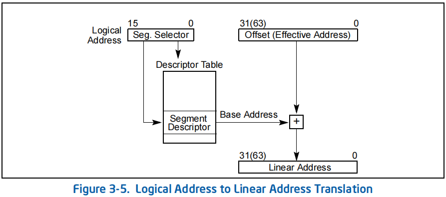
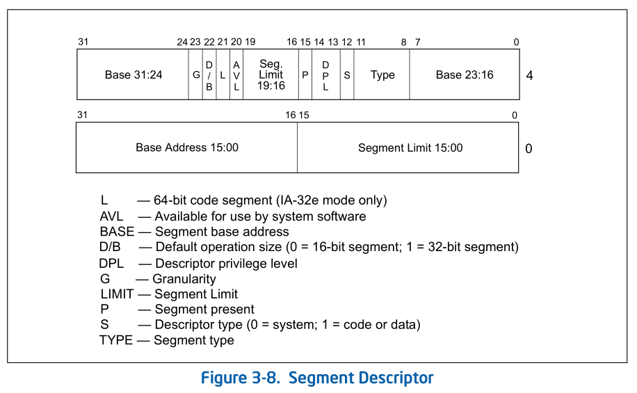
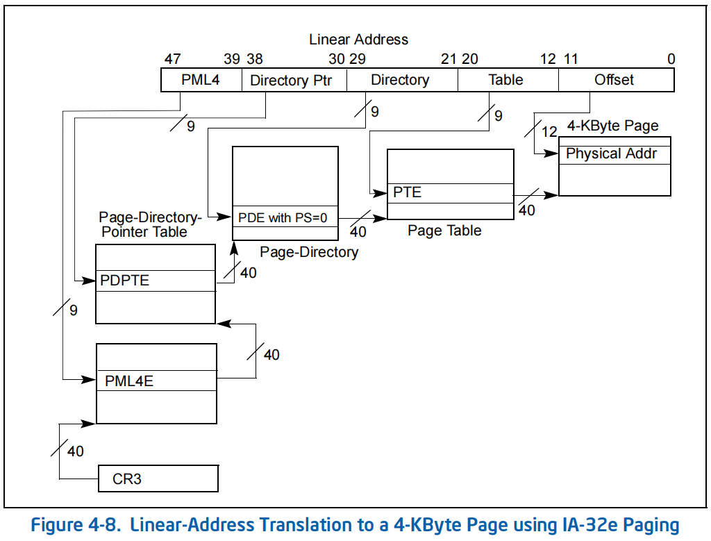
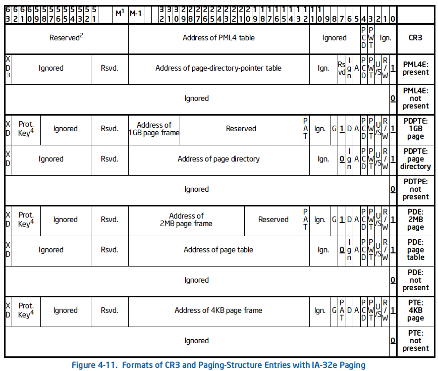

# 总论

内存管理其实和安全密不可分，因为内存是最重要的资源。

X86 的内存管理是段页式的。而在实际的使用中，[[Linux]] 只使用了页式管理，而对于段式管理，Linux 无法绕过（因为 X86 的兼容性），所以只能尽可能地应付，不过 Linux 也并非完全没有利用段式管理，Linux 的权限等级机制就建立在段式机制之上，同时在进程切换的时候也利用到了 TSS 来保存栈指针。

其实不只是 Linux 不再强调，到了 X64 时代，主要段寄存器均强制为 0 ，段长度强制为 264 ，也就是说，在硬件上就已经不再支持段机制了。

而且，不仅硬件和操作系统不强调了，连编译器都默认忽略段式内存管理，它没有办法编译出带有段的汇编，如果非得需要，那么就需要手写汇编。段式内存其实对于编译器也并不友好，因为它在硬件上要求语义，所以给了编译器、操作系统、用户程序很大的限制。

# 实模式

在实模式下，X86 拥有 16 位的段寄存器（Segment Register），在地址计算中，依照的公式是：

$addr = seg << 4 + off$

之所以要这样设计，是因为 16 位的实模式具有 20 位的地址空间，16 位的寄存器无法表示完整的地址，所以就采用两个寄存器来表示地址。

此时用户使用的地址被称为“逻辑地址”，形如 `0812h:0004h` 。地址翻译流程是：

逻辑地址 =\> 物理地址。

我们在寻址的过程中并没有必要每次都显式地声明段寄存器，X86 具有默认的段寄存器，比如在代码段寻址（也就是发生 `call` 或者 `jmp` 过程）默认使用 `CS` 寄存器，访问数据默认使用 `DS` 寄存器，访问栈数据默认使用 `SS` 寄存器，在进行字符串操作时 `ES`

总的来说，段的语义特点是非常强的，有的段专门对应代码，有的段专门对应数据。按理说其实只是“用两个 16 位寄存器表示 20 位地址”的事情，其实没有必要要这么强的语义特性。我个人感觉可能是因为 8086 时代高级语言还没有诞生，8086 程序员需要使用汇编进行编程，所以有强语义的段寄存器，就可以降低编码汇编的难度（不需要显式指定段寄存器，不需要自己设计段的语义）。

这个“降低汇编编写难度”的灵感没准是正确的，这个灵感也可以解释为什么 X86 是 CISC 而非 RISC 的，这是因为 CISC 的汇编更容易手写，而 RISC 因为每条语句的功能都很简单，所以写汇编的程序员就需要写更多条指令，是并不友好的，但是 RISC 对于编译器很友好，因为它的模型简单，编译器很容易就可以优化 RISC 的代码，程序员不再需要写汇编，只需要写高级语言就好了，此时再去看 CISC ，当然是一脸嫌弃了。

实模式的段并没有段长度（都是默认 216 ，因为偏移量是 16 位寄存器）和权限控制的设计，所以并不安全。

# IA-32

## 选择子与描述符

Intel 在 80286 上完善了 8086 的段式内存管理。实模式下段式内存最大的问题在于 16 位的段寄存器不足以描述段的元数据（比如段上限，读写权限，特权等，也包括段的基地址）。所以最重要的任务就是完善元数据的表达形式，而这必须依赖内存。

下面介绍的是 IA-32 的段式机制（插一嘴，其实如果搜索“x86 某某 feature”，其实是不如搜索“IA-32/IA-32e 某某 feature” 要准确的）。

总的来说，就是 IA-32 选择不在段寄存器中直接描述段的元数据，而是将不同段的元数据组成一个（其实是多个）数组放在内存，而原来的段寄存器成了一个“索引（数组的索引）”，用于到内存中检索对应的段的元数据然后应用。这构成来一组关系，即“段选择子（Selector）– 段描述符（Desriptor）”关系，其中选择子对应段寄存器中的索引，描述符对应段的元数据。此外，我们管描述符组成的数组叫做描述符表（Descriptor Table, DT），我们管保存这个描述符表的基地址的寄存器叫做 Desriptor Table Register （DTR）。也就是这个逻辑：

那么是不是内存中只有一个描述符表呢？并不是的。按照 IA-32 的硬件设计，它希望系统中有两类表，一类表是全局表（global），就是 OS 的段的元数据都会记录在这个表中；而另一类是局部表（local），每个用户进程都会由一个局部表来记录它自己段的元数据，切换进程地址空间的本质就是切换局部表。段选择子的样子也被设计成来这样：

其中高 13 位用于充当索引（也就是一个描述符表最多有 213 个描述符），而第 2 位描述符表指示器（Table Indicator，TI）用于确定是在 GDT 中查询还是在 LDT 中查询。相应的，DTR 也有 `GDTR, LDTR` 两种，指向全局表和当前的局部表。

下面是段描述符的格式

遗憾地是，Linux 等系统并没有采用这种方式，它们所有的段均位于全局表 GDT 中（共有内核代码段，内核数据段，用户代码段和用户数据段 4 个条目），切换地址空间也没有修改这些条目，而是通过修改 `CR3` 寄存器（也就是完全没有利用段式的机制）。在 wine 中用到了 LDT 。

## 门

那么是不是 DT 中记录的都是段的元数据呢？并不是的。DT 中还记录了 Gate 的元数据（和段的记录形式非常类似）。不过 Gate 是和权限管理和任务管理相关的，和内存管理联系不大，所以就不在这里赘述了。

## TSS

除了原本的“代码段、数据段”这样的段的种类，有没有什么新增的段的种类？是有的，我们新增了“任务状态段（Task State Segment, TSS）”。这种段主要用于保存上下文（Context），就是一堆通用寄存器，栈指针之类的东西。没有错，IA-32 可以用硬件来实现保存上下文的过程，你只需要给出 TSS 的选择子，硬件就会自动帮你把上下文保存到你指定的 TSS 中。

可惜得是，Linux 依然没有采用这种硬件保存方式。这是因为硬件虽然可以进行加速，但是保存一个庞大的上下文依然是有很大的开销。而且这种保存是非常死板的，说保存多少个就保存多少个，这很不利于软件的优化。

# 段页式

Intel 在 80386 上引入了页式内存管理。其地址翻译流程，变成了先经过段式翻译，再经过页式翻译，流程如下：

逻辑地址（段式内存） =\> 线性地址（页式内存） =\> 物理地址

在进行权限检测时，需要先通过段式检验，然后再通过页式检验，所以在 x86 发展的后期，即使段式内存管理退化，也不太需要担心担心权限问题。

在 80386 上，还引入了 `FS, GS` 寄存器进行线程局部存储 (Thread Local Storage, TLS) 。

# IA-32e

在 64 位模式下，段式管理通常（但不是完全）被禁用，从而创建一个平坦（flatten）的 64 位线性地址空间。处理器将 `CS` 、 `DS` 、 `ES` 、 `SS` 的段基址视为零，创建一个等于有效地址的线性地址。 `FS` 段和 `GS` 段都是例外。这些段寄存器（保持段基）可用作线性地址计算中的附加基寄存器。它们有助于处理本地数据和某些操作系统数据结构。

而页式管理采用 4 级页表：

各个页表项结构如下：

