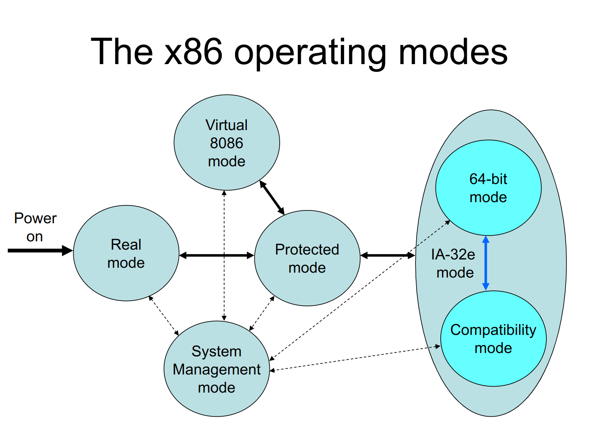
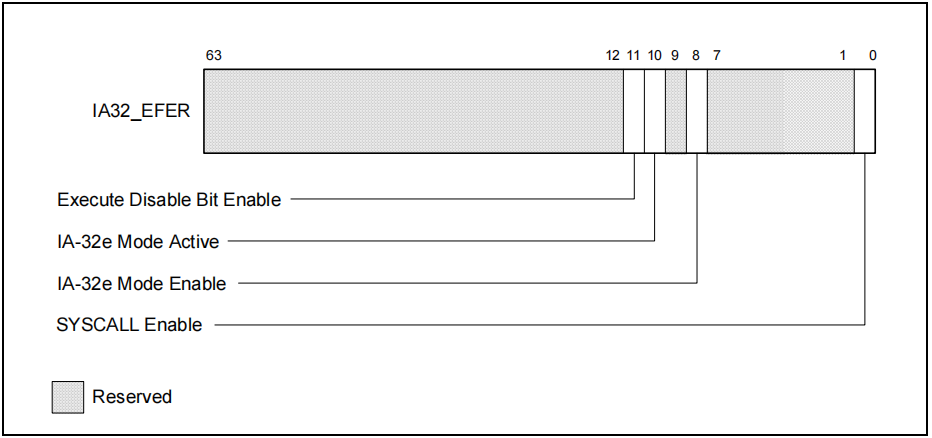

# 总论

X86 存在多个模式，这里的模式有些类似于 Armv8 具有 A32 和 A64 两种指令集一样。不同模式使得 X86 的兼容性得到了很好的保证。

这些模式分别是：

1.  实模式（Real Mode）：上电后的模式，在 8086 上就有的最古老模式
2.  保护模式（Protected Mode）：增加了权限管理功能。
3.  虚拟 8086 模式：供保护模式模拟实模式（保护模式似乎不能直接切换实模式）。
4.  系统管理模式（System Management Mode, SMM）：类似于 ARM 中的 EL3 ，用于负责安全、启动、设备（[[ACPI]]）等功能。

上面这 4 种模式看作是 IA-32 Mode （Intel Architecture, 32-bit）的子模式。IA-32 这个概念的发明有些类似于 A32 的发明，因为 64 位模式要来了，所以把之前的 32 位模式甚至是 16 位模式统统打包在一起，提出一个 IA-32 或者 A32 的概念。

有趣的是，X86 的 64 位模式叫做 IA-32e Mode （extend）而并非 IA-64 Mode ，这是因为 IA-64 这个名字被安腾占用了（参见 [[X86 History]]）。当然我觉得其实叫做 AMD64 或者 X86-64 都可以，似乎是因为 X86 一直存在两家公司竞争的关系，所以同一个事物的名字并不唯一。

IA-32e 又具有两个子模式：

1.  64 位模式（64-bit Mode）：即 64 位模式，也被称作长模式（long-mode）
2.  兼容模式（Compatibility Mode）：使得在 64 位操作系统上能够运行 32 位的程序

这些模式不仅在内存使用中存在差异，在寄存器、中断、权限管理和任务切换方面都存在差异，但是如果统一介绍，那么篇幅就过长了。

# 实模式

实模式是上电后的第一个模式，是一个 16 位的模式，有 20 位的地址空间。

BIOS 就是运行在实模式下的，另外说一嘴，BIOS 不止负责启动，它还为操作系统提供了一些服务（BIOS routines，类似于 [[RISCV]] 的 [[SBI]]）设计，我们可以使用 `int` 指令来触发。

另外，只有在实模式下才可以使用 BIOS routines ，在保护模式下不可以。

# IA-32e

## IA-32e Setup

从保护模式进入 IA-32e 需要配置 EFER (Extended Feature Enable Register) 寄存器。它的格式如下：

其中 `syscall enable` 指的是在 64 位模式下启动 `SYSCALL/SYSRET` 指令。

## 兼容模式

在 IA-32e 中，内核是 64 位的，而用户态可以是 64 位，也可以是 32 位的。
