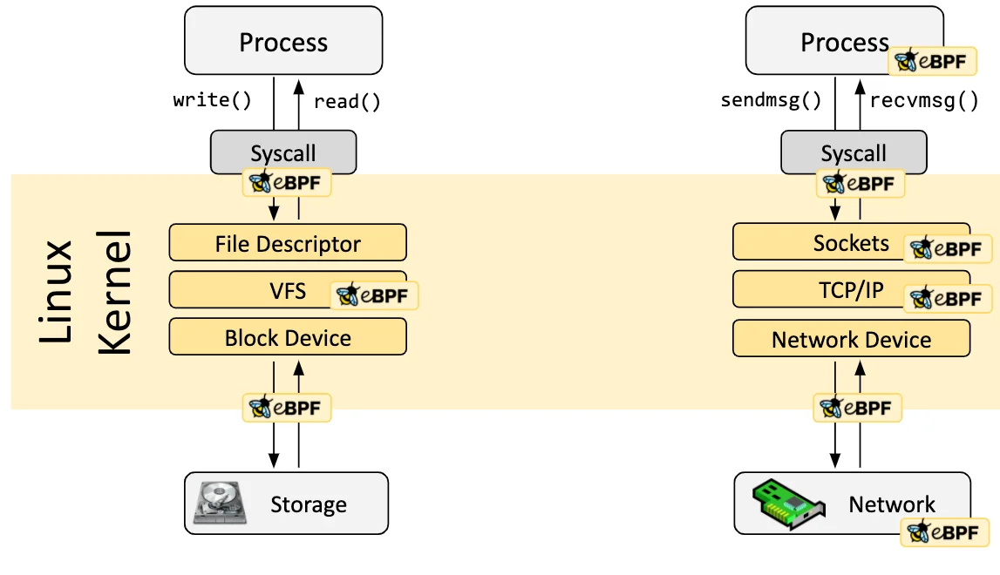

# 内核解释器

eBPF (Extended Berkeley Packet Filter) 可以在特权上下文中（如操作系统内核）运行沙盒程序。它用于安全有效地扩展内核的功能，而无需通过更改内核源代码或加载内核模块的方式来实现。

换句话说，eBPF 之于 [[Linux]] Kernel，就是 V8 Engine 之于 Chrome ，Elisp 解释器之于 Emacs, Lua 解释器之于 Neovim 。

它是一个解释器，同时也可以理解为一个运行 eBPF 字节码的虚拟机。

# 与内核模块的对比

我们为什么需要 eBPF ？这是因为 eBPF 弥补了以往内核在功能可拓展性方面过于死板的缺点。

如果我们希望给内核增添一个新的功能，直观上我们需要修改 Linux 内核。但是 Linux 作为一个通用的操作系统，修改补丁必须被视为有利于社区利益的变革，得到开源社区的接受。这并不容易，大约只有三分之一的补丁合并到了 Kernel 上游。

此外我们还可以通过 [[Kernel Module]] 的方式，内核模块可以独立于官方 Linux 内核版本进行分发，允许其他人使用它，无需被 Kernel 上游接受。但是如果内核模块崩溃，会导致整个操作系统崩溃，其上运行的用户进程也都会崩溃，这是宏内核的劣势。

除了可靠性以外，内核模块的安全性也让人担忧，模块作者可以在模块中植入恶意代码，而这些恶意代码会以操作系统特权级别进行运行，有极强的攻击性。

此外，内核内部的函数变化速度也很快（系统调用比较稳定），这导致内核模块的维护成本也很大，只要内核一变化，牵扯到的内核模块也要作出相应调整。

而 eBPF 则没有这种顾虑，eBPF 程序在运行前必须经过 `eBPF verifier` 的检验，它会确保程序不会导致死循环和数据泄漏；同时，它为其上运行的程序提供了一个沙盒，使得其安全性得到增强。同时它有稳定的语言 API ，避免了频繁的同步。

# 特性

## 事件驱动

eBPF 程序是事件驱动的，当内核或应用程序通过某个钩子点时运行。预定义的钩子包括系统调用、函数入口/退出、内核跟踪点、网络事件等。

## 加载和验证

确定所需的钩子后，可以使用 bpf 系统调用将 eBPF 程序加载到 Linux 内核中。

eBPF 程序在执行前需要经过检验：

- 加载 eBPF 程序的进程必须有所需的能力（特权）。除非启用非特权 eBPF，否则只有特权进程可以加载 eBPF 程序。
- eBPF 程序不会崩溃或者对系统造成损害。
- eBPF 程序一定会运行至结束（即程序不会处于循环状态中，否则会阻塞进一步的处理）。

## JIT 编译

JIT (Just-in-Time) 编译步骤将程序的通用字节码转换为机器特定的指令集，用以优化程序的执行速度。这使得 eBPF 程序可以像本地编译的内核代码或作为内核模块加载的代码一样高效地运行。

## 数据结构

eBPF 程序的其中一个重要方面是共享和存储所收集的信息和状态的能力。为此，eBPF 程序可以利用 eBPF maps 的概念来存储和检索各种数据结构中的数据。eBPF maps 既可以从 eBPF 程序访问，也可以通过系统调用从用户空间中的应用程序访问。

## 开发语言

虽然运行在 eBPF 上的是 BPF 字节码，但这并不意味着我们要用这种语言进行开发，在开源社区的帮助下，我们 C/C++, Python, Rust 等语言开发 BPF 程序。

# BPF 与 eBPF

最开始的 `BPF` 是为了网络监测工具打造的。网络监测工具是一个用户进程，而网络协议栈是在内核实现，所以这本质是一个用户进程监视内核的逻辑。这需要内核频繁得将自己的信息传递给用户程序，导致了性能的降低。

所以更为恰当的方法就是将监视工作直接移到内核中，但是内核本身有应该承载这么自定义性强，且和内核功能没有明显相关性的程序。BPF 创造性地提出了在内核中内置一个 BPF 结构，用户监视程序可以给这个 BPF 传递一些“规则”，这些规则（过滤器 filter）可以用于高自由度地监视网络，如下所示：

后来有个大牛拓展了 BPF ，扩展后的 BPF 通常缩写为 eBPF。eBPF 中增加了更多寄存器，并将字长从 32 位增加到了 64 位，创建了灵活的 BPF 映射型存储（map）,并允许调用一些受限制的内核功能。同时 eBPF 被设计为可以使用即时编译（JIT）,机器指令与寄存器可以一对一映射。这就使得先前的处理器本地指令优化技术，可以应用到 BPF 之上。BPF 验证器也进行了更新以便支持这些扩展，而且能够拒绝任何不安全的代码。

两者对比如下：

| 对比项 | 经典BPF | 扩展BPF |
|----|----|----|
| 寄存器数量 | 2 个；寄存器 A 和 X | 10 个；R0 ~ R9 ,此外 R10 是只读的帧指针寄存器 |
| 寄存器宽度 | 32 位 | 64 位 |
| 存储 | 16 个内存槽位：M\[0~15\] | 512 字节大小的栈空间，外加无限制的映射型存储 |
| 受限制的内核调用 | 非常受限，JIT 专用 | 可用，通过 `bpf_call` 指令 |
| 支持的事件类型 | 网络数据包、sccomp-BFP | 网络数据包、内核函数、用户态函数、跟踪点、用户态标记、PMC |
