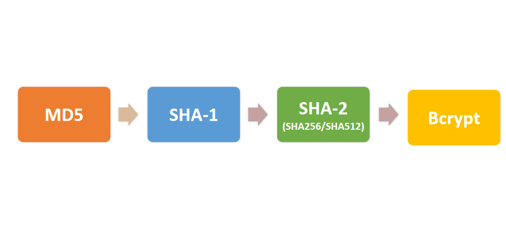

密码散列函数又称为密码哈希函数，大多数加密散列函数设计为采用任意长度的字符串作为输入并生成固定长度的哈希值。

散列函数应该有如下性质：

1.  相同的消息始终导致相同的哈希值（即，函数为确定性).
2.  快速计算哈希值。
3.  具有相同散列值的两个消息（称为“冲突”）是不可行的。
4.  故意创建产生给定哈希值的消息是不可行的。
5.  对消息的轻微更改应在很大​​程度上更改所得的哈希值，以使其看起来与原始哈希不相关。

常见的哈希函数有 MD5, SHA-1, SHA-2 等，其发展历史如下所示：

