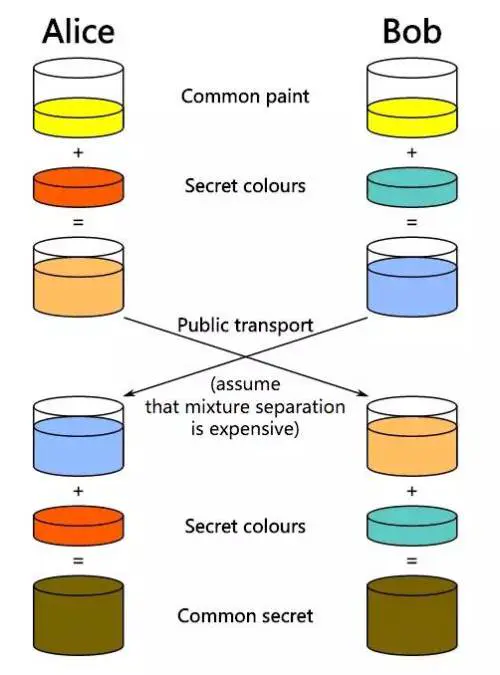

密钥交换（Key exchange）算法的功能是在两方之间安全地交换加密密钥。主要解决的是密钥在不安全信道中的同步问题。两个代表算法是 Diffie-Hellman (DH) 和 Elliptic-Curve Diffie-Hellman (ECDH) 。

但是我都不会，所以我打算用一个“颜色混合”的例子介绍：

Alice 和 Bob 要在公开的信道上，协商出一个秘密色彩出来，但是不希望其他任何人知道这个秘密色彩。他们可以这样做：

- 首先 Alice 跟 Bob 沟通，确定一个初始的色彩，比如黄色。这个沟通不需要保密。
- 然后，Alice 跟 Bob 分别偷偷地选择出一个自己的秘密色彩，这个就得保密啦。
- 现在 Alice 跟 Bob，分别将初始色彩跟自己选择的秘密色彩混合，分别得到两个混合色彩。
- 之后，Alice 跟 Bob 再回到公开信道上，交换双方的混合色彩。
- 我们假设在仅知道初始色彩跟混合色彩的情况下，很难推导出被混合的秘密色彩。这样第三方就猜不出 Bob 跟 Alice 分别选择了什么秘密色彩了。
- 最后 Alice 跟 Bob 再分别将自己的秘密色彩，跟对方的混合色彩混合，就得到了最终的秘密色彩。这个最终色彩只有 Alice 跟 Bob 知道，信道上的任何人都无法猜出来。

DH 协议也是基于类似的原理，但是使用的是离散对数（discrete logarithms）跟模幂（modular exponentiations）而不是色彩混合。
