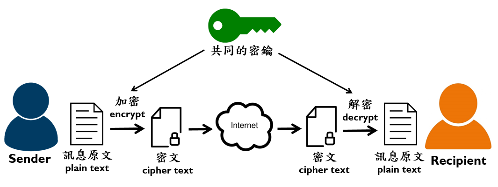

对称加密（symmetric encryption）算法就是传统的用同一个密钥进行加密和解密。如下图所示：

对称加密的问题在于密钥需要在发送方和接受方之间同步，而在不安全的信道里同步密钥是有风险的。因此人们开发了[[密钥交换算法]]和[[非对称加密]]技术。

常见的对称加密算法有：

| 算法 | 密钥长度        |
|------|-----------------|
| DES  | 56 / 64         |
| AES  | 128 / 192 / 256 |
| IDEA | 128             |

其中密钥长度直接决定加密强度，DES 由于密钥长度过短，所以可以直接破译，已经不安全了。目前最流行的是 AES 。

DES 作为强加密，拥有混淆 (Confusion) 和扩散 (Diffusion) 特征，混淆指的是秘钥和密文之间关系尽可能模糊，扩散指的是一个明文符号的影响能波及到多位密文（即改动一个位就会导致密文发生较大变化）。
