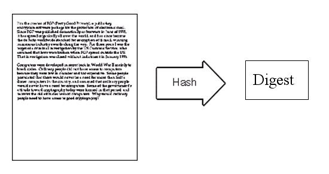

数字签名本义是解决发送者的身份真实性问题（也就是这个文件真的是这个人发送的，也就是现实生活中“签名”的意思）。此外还可以用于解决密文的完整性问题，也就是检验是否密文被篡改（这个部分其实是有“摘要”实现的）。

发送方会利用[[密码散列]]来给原本的明文生成一个摘要（Digest），摘要的本质是明文的一个压缩镜像，如下所示：

然后发送方再将摘要用私钥加密生成签名（Signature），附在明文之后：

接受方收到信件后，为了检验完整性，可以用发送方的公钥解密签名，得到摘要，在和自己收到的明文生成的摘要进行比对，如果一致则说明没有被篡改。

那么为什么突然要引入摘要这个东西呢？我个人觉得从理论上说，甚至可以直接将一整份明文作为签名，附在明文之后，这样同样可以检验完整性。问题在于非对称加密的性能太差了，所以私钥加密一大段明文太累了，所以我们先用密码散列生成一个较短的摘要，在用私钥加密，提高了性能。

另外突然想到，其实这个明文并不一定需要私钥加密，它可能是一个对称加密过程，接受方收到后要先用对称密钥解密出签名，再用非对称私钥解密签名出摘要。这样比较符合性能要求。
