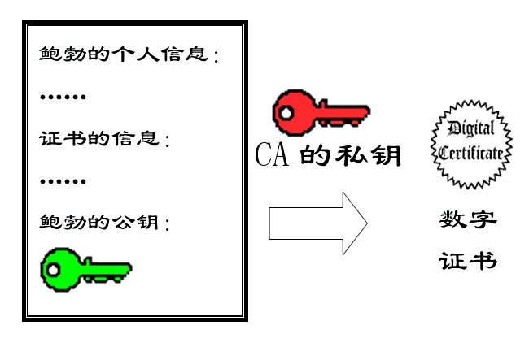
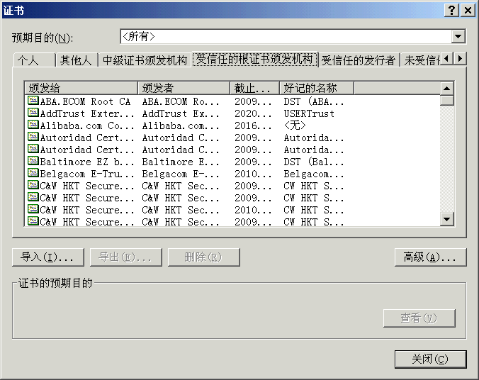
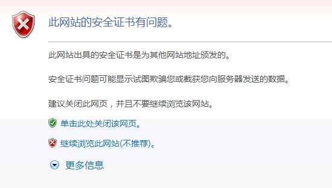

数字证书（Digital Certificate）要解决的是发送方来源的问题，本质是利用了一个不可伪造的公钥，也就是“证书中心”（certificate authority，简称 CA）的公钥。

通过信道传过来的公钥可能不是发送方的公钥，而是攻击者伪造的公钥，所以发送方为了增强自己公钥的可信度，可以去 CA 做公证，CA 用自己的私钥，对鲍勃的公钥和一些相关信息一起加密，生成数字证书。如下所示：

发送方在传输的时候附上自己的数字证书，接受方会用 CA 的公钥解密这个数字证书，然后将其中的公钥作为发送方的公钥。攻击者无法伪造数据证书，因为它无法伪造 CA 的公钥，它没法骗发送方自己的公钥就是 CA 的公钥。因为 CA 是一个权威性组织。

一个数字证书的例子是 [[HTTPS]] 协议。服务器用自己的私钥加密网页以后，连同本身的数字证书，一起发送给客户端。客户端（浏览器）的"证书管理器"，有"受信任的根证书颁发机构"列表。客户端会根据这张列表，查看解开数字证书的公钥是否在列表之内。

如果数字证书记载的网址，与你正在浏览的网址不一致，就说明这张证书可能被冒用，浏览器会发出警告。

