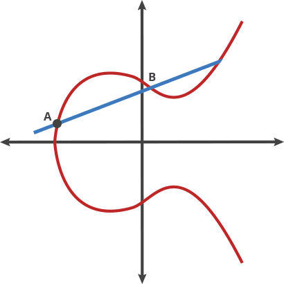

目前流行的公钥密码系统基本都依赖于 IFP（整数分解问题）、DLP（离散对数问题）或者 ECDLP（椭圆曲线离散对数问题）

- 整数分解：素数相乘得到的因式很难分解回来
- 离散对数：假设在整数范围内，对数 $x = \log_{b}^{a}$ ，已知 $x, b$ ，计算 $a$ 很容易；但是已知 $a, b$ ，计算 $x$ 很困难。
- 椭圆曲线：椭圆曲线通用方程为 $y^{2} = x³ + ax + b$ 任何一条不垂直的直线与曲线的交点不超过 3 个。定义一种运算，曲线上两个点为 $A, B$，$AB$ 连直线得到 $C^{' }$ ，$C^{' }$ 关于 x 轴有对称点 $C$ ，称作 $ A \space dot \space B = C$ 。给定一个初始点 $A$ ，一个动点 $B$ ，经过 $n$ 次 $dot$ 运算之后得出 $Z$ ，从 $A, Z$ 求出 $n$ 比较困难。

如果人类进入量子时代，IFP / DLP / ECDLP 的难度将大大降低，这些算法都是量子不安全（quantum-unsafe）的。目前流行的 RSA、ECC、ElGamal、Diffie-Hellman、ECDH、ECDSA 和 EdDSA 等公钥密码算法都将被淘汰。

目前已经有一些量子安全的公钥密码系统问世，但是因为它们需要更长的密钥、更长的签名等原因，目前还未被广泛使用。

一些量子安全的公钥密码算法举 例：NewHope、NTRU、GLYPH、BLISS、XMSS、Picnic 等。
