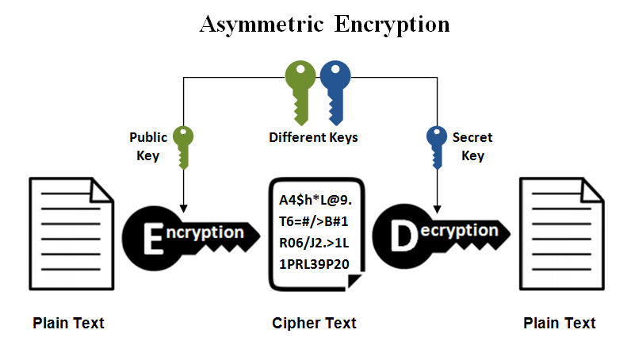

# 公钥与私钥

非对称加密（Asymmetric cryptography）也称为公开密钥密码学（Public-key cryptography）。它需要两个密钥，一个是公钥（Public key），另一个是私钥（Private key）；公钥用作加密，私钥则用作解密。使用公钥把明文加密后所得的密文，只能用相对应的私钥才能解密并得到原本的明文，最初用来加密的公钥不能用作解密。如下所示：

由于加密和解密需要两个不同的密钥，故被称为非对称加密；不同于加密和解密都使用同一个密钥的对称加密。公钥可以公开，可任意向外发布；私钥不可以公开，必须由用户自行严格秘密保管，绝不透过任何途径向任何人提供，也不会透露给被信任的要通信的另一方。

# 加密与解密

严格来说，公钥和私钥都可以进行加密和解密：私钥加密的文件，公钥可以解密，而公钥加密的文件，用私钥可以解密。

不过在实际的功能中，则是 **“公钥加密私钥解密”** 和 **“私钥签名公钥验证”** 。这是因为对于加解密而言，用私钥加密没有意义，所有人手里都有公钥，所以所有人都可以解密密文。不过我们可以用私钥进行签名（本质上也是一种加密），让其他人用公钥检验（本质是解密），这样我们可以确认签名真的是来自私钥的持有者（也就是签名的真正含义）。

# 现代密码学

现代密码学的开端就是非对称加密算法的创立，这是因为非对称加密算法不仅解决了[[对称加密]]算法密钥交换的漏洞，同时还对于检验密文的完整性和来源都提供了帮助。[[数字证书]]和[[数字签名]]技术都基于此进行开发。

非对称密码解决了对称密码的三个问题：

- 秘钥分配
- 秘钥数量
- 用户欺骗

非对称算法主要有 RSA、DSA 等。

# KEM

非对称密码比对称密码慢非常多。比如 RSA 加密比 AES 慢 1000 倍，跟 ChaCha20 就更没法比了。所以我们一般不用非对称加密完成全部通信，而是使用密钥封装机制 KEM（key encapsulation mechanisms) ，也就是：

- 使用公钥加密传输对称密钥

- 使用私钥解密出对称密钥，然后再使用这个对称密钥解密数据

